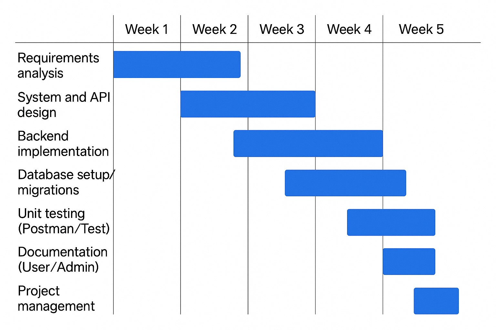

# Project Estimation

Date: 2025-04-17

Version: 1.0

# Estimation approach

Consider the GeoControl project as described in the swagger, assume that you are going to develop the project INDEPENDENT of the deadlines of the course, and from scratch

# Estimate by size

###

|                                                                                                           | Estimate |
| :---------------------------------------------------------------------------------------------------------- | :------- |
| NC = Estimated number of classes to be developed                                                          | 60       |
| A = Estimated average size per class, in LOC                                                              | 100      |
| S = Estimated size of project, in LOC (= NC \* A)                                                         | 6000     |
| E = Estimated effort, in person hours (here use productivity 10 LOC per person hour)                      | 600      |
| C = Estimated cost, in euro (here use 1 person hour cost = 30 euro)                                       | 18000    |
| Estimated calendar time, in calendar weeks (Assume team of 4 people, 8 hours per day, 5 days per week ) | 3.75     |

# Estimate by product decomposition

###

| component name     | Estimated effort (person hours) |
| :----------------- | :------------------------------ |
| requirement document | 40                            |
| design document    | 60                            |
| code               | 300                           |
| unit tests         | 80                            |
| api tests          | 80                            |
| management documents | 40                            |
| **Total** | **600** |

# Estimate by activity decomposition

###

| Activity name         | Estimated effort (person hours) |
| :-------------------- | :------------------------------ |
| Requirements gathering | 40                            |
| Architecture design   | 30                            |
| UI/UX Design          | 30                            |
| Backend development   | 180                           |
| Frontend development  | 120                           |
| Database setup        | 40                            |
| Testing (unit + API)  | 160                           |
| Documentation         | 40                            |
| Project management    | 40                            |
| **Total** | **680** |

## Gantt Chart

###

# Summary

|                                  | Estimated effort | Estimated duration |
| :------------------------------- | :--------------- | :----------------- |
| estimate by size                 | 600 hours        | 3.75 weeks         |
| estimate by product decomposition | 600 hours        | ~3.75 weeks        |
| estimate by activity decomposition | 680 hours        | ~4.25 weeks        |

The "estimate by activity decomposition" predicts slightly more effort (680 hours) and a longer duration (~4.25 weeks) compared to the other two methods (600 hours, ~3.75 weeks).

**Reasoning for Differences:**

* **Granularity:** The "activity decomposition" breaks the project into more specific tasks (like requirements, design, etc.). This detailed analysis shows the efforts that the other methods might overlook.

* **Explicit vs. Implicit Effort:** The 80-hour difference likely represents the effort explicitly allocated to supporting activities (requirements, design, management, etc.) in the activity-based estimate, whereas the other methods might have less explicit accounting for these tasks within the overall code development or deliverable creation estimates.

Overall, the more detailed breakdown in the "activity decomposition" provides a potentially more comprehensive effort and duration estimate.