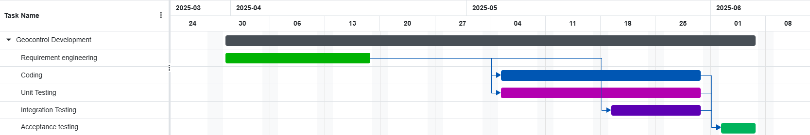

# Project Estimation part 2

In this document the differences between the estimated and the actual effort for the project are highlighted.

## Comparison

|                                        | Estimated (end of task 1) | Actual (june 7, end of task 3)|
| -------------------------------------------------------------------------------- | -------- |----|
| production code size | -  | 2328 |
| test code size | - | 7993 |
| total size  | 6000 | 10321 |
| effort | 600 | 131 |
| productivity  | 10 loc / hour | 79 loc / hour |

## Estimate by activity decomposition

| component name       | Estimated effort (person hours) |
|----------------------|---------------------------------|
| requiremens          | 51                              |
| coding               | 20                              |
| unit testing         | 24                              |
| integration testing  | 16                              |
| acceptance testing  | 20                              |

## Gantt chart

    {"data":[{"TaskID":1,"TaskName":"Geocontrol Development","StartDate":"2025-03-31T06:00:00.000Z","EndDate":"2025-06-06T15:00:00.000Z","Duration":50,"Predecessor":null,"resources":[],"Progress":100,"color":"","info":"
 
","DurationUnit":"day","subtasks":[{"TaskID":2,"TaskName":"Requirement engineering","StartDate":"2025-03-31T06:00:00.000Z","EndDate":"2025-04-18T15:00:00.000Z","Duration":15,"Predecessor":"","resources":[{"resourceId":"Team Member 1","resourceName":"Team Member 1","unit":100}],"Progress":100,"color":"121","info":"
 
","DurationUnit":"day"},{"TaskID":3,"TaskName":"Coding","StartDate":"2025-05-05T06:00:00.000Z","EndDate":"2025-05-30T15:00:00.000Z","Duration":20,"Predecessor":"2FS+10 days","resources":[{"resourceId":"Team Member 2","resourceName":"Team Member 2","unit":100}],"Progress":100,"color":"211","info":"
 
","DurationUnit":"day"},{"TaskID":4,"TaskName":"Unit Testing","StartDate":"2025-05-05T06:00:00.000Z","EndDate":"2025-05-30T15:00:00.000Z","Duration":20,"Predecessor":"2FS+10 days","resources":[{"resourceId":"Team Member 3","resourceName":"Team Member 3","unit":100}],"Progress":100,"color":"301","info":"
 
","DurationUnit":"day"},{"TaskID":6,"TaskName":"Integration Testing","StartDate":"2025-05-19T06:00:00.000Z","EndDate":"2025-05-30T15:00:00.000Z","Duration":10,"Predecessor":"2FS+20 days","resources":[],"Progress":100,"color":"271","info":"
 
","DurationUnit":"day"},{"TaskID":7,"TaskName":"Acceptance testing","StartDate":"2025-06-02T06:00:00.000Z","EndDate":"2025-06-06T15:00:00.000Z","Duration":5,"Predecessor":"6FS,4FS,3FS","resources":[],"Progress":100,"color":"151","info":"
 
","DurationUnit":"day"}]}],"resources":[{"resourceId":"Team Member 1","resourceName":"Team Member 1"},{"resourceId":"Team Member 2","resourceName":"Team Member 2"},{"resourceId":"Team Member 3","resourceName":"Team Member 3"}],"projectStartDate":null,"projectEndDate":null,"advanced":{"columns":[{"name":"Task ID","width":"70","show":true},{"name":"Task Name","width":"350","show":true},{"name":"Start Date","width":"130","show":false},{"name":"End Date","width":"130","show":false},{"name":"Duration","width":"130","show":false},{"name":"Progress %","width":"150","show":false},{"name":"Dependency","width":"150","show":false},{"name":"Resources","width":"200","show":false},{"name":"Color","width":"100","show":false}],"zoomLevel":0,"timezone":"Europe/Rome","timezoneOffset":-120,"dependencyConflict":"Add Offset to Dependency","dateFormat":"yyyy-MM-dd","timeFormat":"HH:mm","firstDayOfWeek":0,"workWeek":["Monday","Tuesday","Wednesday","Thursday","Friday"],"workTime":[{"from":8,"to":12},{"from":13,"to":17}],"holidays":[]}}

