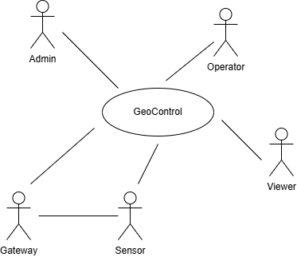
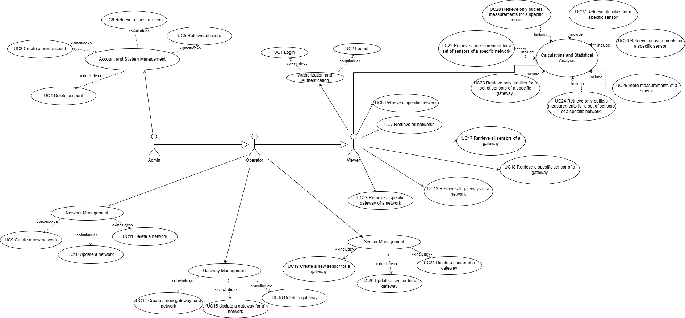
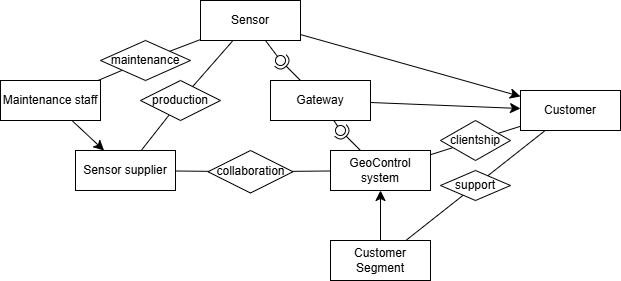
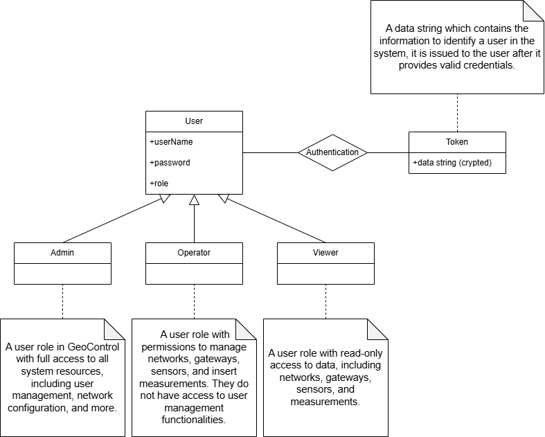
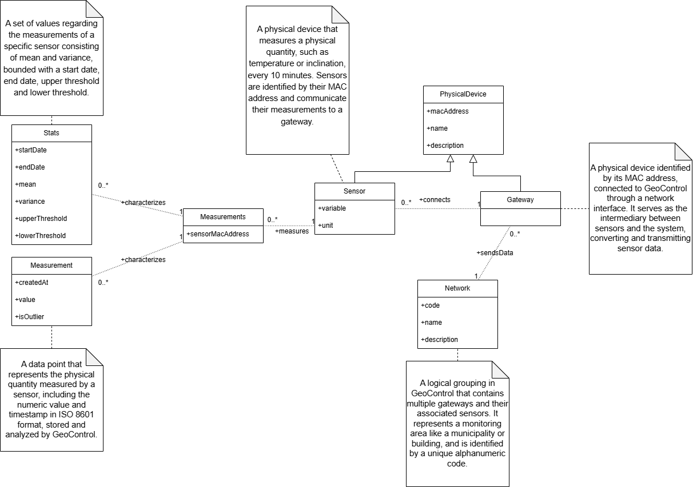
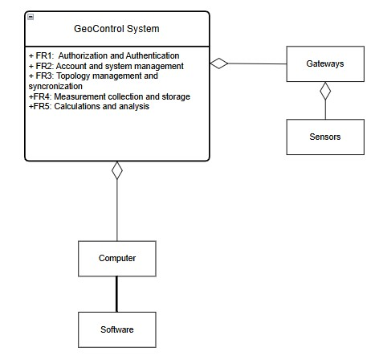
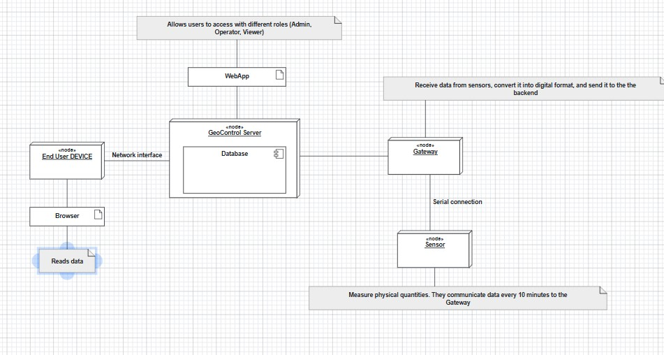

# Requirements Document - GeoControl

Date: 2025-04-17

Version: V1 - description of Geocontrol as described in the swagger

| Version number | Change |
| :------------: | :----: |
|       1.0      | Initial Version |

# Contents

- [Requirements Document - GeoControl](#requirements-document---geocontrol)
- [Contents](#contents)
- [Informal description](#nformal-description)
- [Business Model](#business-model)
  - [Value Proposition](#value-proposition)
  - [Customer Segments](#customer-segments)
  - [Channels](#channels)
  - [Customer Relationships](#customer-relationships)
  - [Revenue Streams](#revenue-streams)
- [Stakeholders](#stakeholders)
- [Context Diagram and interfaces](#context-diagram-and-interfaces)
  - [Context Diagram](#context-diagram)
  - [Interfaces](#interfaces)
- [Stories and personas](#stories-and-personas)
    - [Personas](#personas)
      - [1. Admin](#1-admin)
      - [2. Operator](#2-operator)
      - [3.Viewer](#3-viewer)
    - [Stories](#stories)
        - [Story 1: Domenico, 36, Environmental Engineer Specializing in Landslide Prevention](#story-1-domenico-36-environmental-engineer-specializing-in-landslide-prevention)
        - [Story 2: Sara, 29, Historic Building Curator](#story-2-sara-29-historic-building-curator)
        - [Story 3: Giacomo, 40, Head of an Agricultural Cooperative](#story-3-giacomo-40-head-of-an-agricultural-cooperative)
- [Functional and non functional requirements](#functional-and-non-functional-requirements)
  - [Functional Requirements](#functional-requirements)
  - [Non Functional Requirements](#non-functional-requirements)
- [Table of Rights](#table-of-rights)
- [Use case diagram and use cases](#use-case-diagram-and-use-cases)
  - [Use case diagram](#use-case-diagram)
    - [Use case 1, Log in](#use-case-1-log-in)
        - [Scenario 1.1: Login](#scenario-11-login)
        - [Scenario 1.2: Invalid input data (empty fields)](#scenario-12-nvalid-input-data-empty-fields)
        - [Scenario 1.3: Wrong username or password](#scenario-13-wrong-username-or-password)
        - [Scenario 1.4: User not found](#scenario-14-user-not-found)
        - [Scenario 1.5: Internal server error](#scenario-15-nternal-server-error)
    - [Use case 2, Logout](#use-case-2-logout)
        - [Scenario 2.1: Logout](#scenario-21-logout)
        - [Scenario 2.2: User already logged out](#scenario-22-user-already-logged-out)
    - [Use case 3, Create a new account for a user](#use-case-3-create-a-new-account-for-a-user)
        - [Scenario 3.1: Account created](#scenario-31-account-created)
        - [Scenario 3.2: Invalid input data](#scenario-32-nvalid-input-data)
        - [Scenario 3.3: Invalid token (Unauthorized)](#scenario-33-nvalid-token-unauthorized)
        - [Scenario 3.4: Insufficient rights (The user is not an admin)](#scenario-34-nsufficient-rights-the-user-is-not-an-admin)
        - [Scenario 3.5: Username unavailable](#scenario-35-username-unavailable)
        - [Scenario 3.6: Internal server error](#scenario-36-nternal-server-error)
    - [Use case 4, Delete account](#use-case-4-delete-account)
        - [Scenario 4.1: Deletion of an account](#scenario-41-deletion-of-an-account)
        - [Scenario 4.2: Invalid token (Unauthorized)](#scenario-42-nvalid-token-unauthorized)
        - [Scenario 4.3: Insufficient rights](#scenario-43-nsufficient-rights)
        - [Scenario 4.4: User not found](#scenario-44-user-not-found)
        - [Scenario 4.5: Internal server error](#scenario-45-nternal-server-error)
    - [UC5: Retrieve all users](#uc5-retrieve-all-users)
        - [Scenario 5.1: Retrieve the list of users](#scenario-51-retrieve-the-list-of-users)
        - [Scenario 5.2: Invalid token](#scenario-52-nvalid-token)
        - [Scenario 5.3: Insufficient rights](#scenario-53-nsufficient-rights)
        - [Scenario 5.4: Internal server error](#scenario-54-nternal-server-error)
    - [Use case 6, Retrieve a specific user](#use-case-6-retrieve-a-specific-user)
        - [Scenario 6.1: Retrieve a specific user](#scenario-61-retrieve-a-specific-user)
        - [Scenario 6.2: Invalid token](#scenario-62-nvalid-token)
        - [Scenario 6.3: Insufficient rights](#scenario-63-nsufficient-rights)
        - [Scenario 6.4: User not found](#scenario-64-user-not-found)
        - [Scenario 6.5: Internal server error](#scenario-65-nternal-server-error)
    - [Use case 7, Retrieve all networks](#use-case-7-retrieve-all-networks)
        - [Scenario 7.1: Retrieve all the networks](#scenario-71-retrieve-all-the-networks)
        - [Scenario 7.2: Invalid token](#scenario-72-nvalid-token)
        - [Scenario 7.3: Internal server error](#scenario-73-nternal-server-error)
    - [Use case 8, Retrieve a specific network](#use-case-8-retrieve-a-specific-network)
        - [Scenario 8.1: Retrieve a network](#scenario-81-retrieve-a-network)
        - [Scenario 8.2: Invalid token](#scenario-82-nvalid-token)
        - [Scenario 8.3: Network not found](#scenario-83-network-not-found)
        - [Scenario 8.4: Internal server error](#scenario-84-nternal-server-error)
    - [Use case 9, Create a new network](#use-case-9-create-a-new-network)
        - [Scenario 9.1: Network Created](#scenario-91-network-created)
        - [Scenario 9.2: Invalid input data](#scenario-92-nvalid-input-data)
        - [Scenario 9.3: Unauthorized](#scenario-93-unauthorized)
        - [Scenario 9.4: Insufficient rights](#scenario-94-nsufficient-rights)
        - [Scenario 9.5: Network code already in use](#scenario-95-network-code-already-in-use)
        - [Scenario 9.6: Internal server error](#scenario-96-nternal-server-error)
    - [Use case 10, Update a network](#use-case-10-update-a-network)
        - [Scenario 10.1: Network updated](#scenario-101-network-updated)
        - [Scenario 10.2: Invalid input data](#scenario-102-nvalid-input-data)
        - [Scenario 10.3: Unauthorized](#scenario-103-unauthorized)
        - [Scenario 10.4: Insufficient rights](#scenario-104-nsufficient-rights)
        - [Scenario 10.5: Network not found](#scenario-105-network-not-found)
        - [Scenario 10.6: Network code already in use](#scenario-106-network-code-already-in-use)
        - [Scenario 10.7: Internal server error](#scenario-107-nternal-server-error)
    - [Use case 11, Delete a network](#use-case-11-delete-a-network)
        - [Scenario 11.1: Delete a network](#scenario-111-delete-a-network)
        - [Scenario 11.2: Invalid token](#scenario-112-nvalid-token)
        - [Scenario 11.3: Insufficient rights](#scenario-113-nsufficient-rights)
        - [Scenario 11.4: Network not found](#scenario-114-network-not-found)
        - [Scenario 11.5: Internal server error](#scenario-115-nternal-server-error)
    - [Use case 12, Retrieve all gateways of a network](#use-case-12-retrieve-all-gateways-of-a-network)
        - [Scenario 12.1: Retrieve all the gateways of a network](#scenario-121-retrieve-all-the-gateways-of-a-network)
        - [Scenario 12.2: Invalid token](#scenario-122-nvalid-token)
        - [Scenario 12.3: Network not found](#scenario-123-network-not-found)
        - [Scenario 12.4: Internal server error](#scenario-124-nternal-server-error)
    - [Use case 13, Retrieve a specific gateway of a network](#use-case-13-retrieve-a-specific-gateway-of-a-network)
        - [Scenario 13.1: Retrieve the gateway of a network](#scenario-131-retrieve-the-gateway-of-a-network)
        - [Scenario 13.2: Invalid token](#scenario-132-nvalid-token)
        - [Scenario 13.3: Network/gateway not found](#scenario-133-networkgateway-not-found)
        - [Scenario 13.4: Internal server error](#scenario-134-nternal-server-error)
    - [Use case 14, Create a new gateway for a network](#use-case-14-create-a-new-gateway-for-a-network)
        - [Scenario 14.1: Gateway created](#scenario-141-gateway-created)
        - [Scenario 14.2: Invalid input data](#scenario-142-nvalid-input-data)
        - [Scenario 14.3: Unauthorized](#scenario-143-unauthorized)
        - [Scenario 14.4: Insufficient rights](#scenario-144-nsufficient-rights)
        - [Scenario 14.5: Network not found](#scenario-145-network-not-found)
        - [Scenario 14.6: Gateway MAC address already in use](#scenario-146-gateway-mac-address-already-in-use)
        - [Scenario 14.7: Internal server error](#scenario-147-nternal-server-error)
    - [Use case 15, Update a gateway for a network](#use-case-15-update-a-gateway-for-a-network)
        - [Scenario 15.1: Gateway updated](#scenario-151-gateway-updated)
        - [Scenario 15.2: Invalid input data](#scenario-152-nvalid-input-data)
        - [Scenario 15.3: Unauthorized](#scenario-153-unauthorized)
        - [Scenario 15.4: Insufficient rights](#scenario-154-nsufficient-rights)
        - [Scenario 15.5: Network not found](#scenario-155-network-not-found)
        - [Scenario 15.6: Gateway not found](#scenario-156-gateway-not-found)
        - [Scenario 15.7: Gateway mac address already in use](#scenario-157-gateway-mac-address-already-in-use)
        - [Scenario 15.8: Internal server error](#scenario-158-nternal-server-error)
    - [Use case 16, Delete a gateway](#use-case-16-delete-a-gateway)
        - [Scenario 16.1: Delete a gateway](#scenario-161-delete-a-gateway)
        - [Scenario 16.2: Invalid token](#scenario-162-nvalid-token)
        - [Scenario 16.3: Insufficient rights](#scenario-163-nsufficient-rights)
        - [Scenario 16.4: Network/Gateway not found](#scenario-164-networkgateway-not-found)
        - [Scenario 16.5: Internal server error](#scenario-165-nternal-server-error)
    - [Use case 17, Retrieve all sensors of a gateway](#use-case-17-retrieve-all-sensors-of-a-gateway)
        - [Scenario 17.1: Retrieve all the sensors of a gateway](#scenario-171-retrieve-all-the-sensors-of-a-gateway)
        - [Scenario 17.2: Invalid token](#scenario-172-nvalid-token)
        - [Scenario 17.3: Network/gateway not found](#scenario-173-networkgateway-not-found)
        - [Scenario 17.4: Internal server error](#scenario-174-nternal-server-error)
    - [Use case 18, Retrieve a spesific sensor of a gateway](#use-case-18-retrieve-a-spesific-sensor-of-a-gateway)
        - [Scenario 18.1: Retrieve the sensor of a gateway](#scenario-181-retrieve-the-sensor-of-a-gateway)
        - [Scenario 18.2: Invalid token](#scenario-182-nvalid-token)
        - [Scenario 18.3: Network/gateway/sensor not found](#scenario-183-networkgatewaysensor-not-found)
        - [Scenario 18.4: Internal server error](#scenario-184-nternal-server-error)
    - [Use case 19, Create a new sensor for a gateway](#use-case-19-create-a-new-sensor-for-a-gateway)
        - [Scenario 19.1: Create a new sensor for a gateway](#scenario-191-create-a-new-sensor-for-a-gateway)
        - [Scenario 19.2: Invalid token](#scenario-192-nvalid-token)
        - [Scenario 19.3: Insufficient rights](#scenario-193-nsufficient-rights)
        - [Scenario 19.4: Network/gateway not found](#scenario-194-networkgateway-not-found)
        - [Scenario 19.5: Internal server error](#scenario-195-nternal-server-error)
        - [Scenario 19.6: Sensor MAC address already in use](#scenario-196-sensor-mac-address-already-in-use)
    - [Use case 20, Update a sensor for a gateway](#use-case-20-update-a-sensor-for-a-gateway)
        - [Scenario 20.1: Sensor MAC address already in use](#scenario-201-sensor-mac-address-already-in-use)
        - [Scenario 20.2: Invalid token](#scenario-202-nvalid-token)
        - [Scenario 20.3: Insufficient rights](#scenario-203-nsufficient-rights)
        - [Scenario 20.4: Network/gateway/sensor not found](#scenario-204-networkgatewaysensor-not-found)
        - [Scenario 20.5: Sensor MAC address already in use](#scenario-205-sensor-mac-address-already-in-use)
        - [Scenario 20.6: Internal server error](#scenario-206-nternal-server-error)
        - [Scenario 20.7: Invalid input data](#scenario-207-nvalid-input-data)
    - [Use case 21, Delete a sensor of a gateway](#use-case-21-delete-a-sensor-of-a-gateway)
        - [Scenario 21.1: Sensor successfully deleted](#scenario-211-sensor-successfully-deleted)
        - [Scenario 21.2: Invalid token](#scenario-212-nvalid-token)
        - [Scenario 21.3: Insufficient rights](#scenario-213-nsufficient-rights)
        - [Scenario 21.4: Network/gateway/sensor not found](#scenario-214-networkgatewaysensor-not-found)
        - [Scenario 21.5: Internal server error](#scenario-215-nternal-server-error)
    - [Use case 22, Retrieve a measurement for a set of sensors of a specific network](#use-case-22-retrieve-a-measurement-for-a-set-of-sensors-of-a-specific-network)
        - [Scenario 22.1: Successful retrieval](#scenario-221-successful-retrieval)
        - [Scenario 22.2: Invalid token](#scenario-222-nvalid-token)
        - [Scenario 22.3: Insufficient rights](#scenario-223-nsufficient-rights)
        - [Scenario 22.4: Network not found](#scenario-224-network-not-found)
    - [Use case 23, Retrieve only statitics for a set of sensors of a specific gateway](#use-case-23-retrieve-only-statitics-for-a-set-of-sensors-of-a-specific-gateway)
        - [Scenario 23.1: Successful retrieval](#scenario-231-successful-retrieval)
        - [Scenario 23.2: Invalid token](#scenario-232-nvalid-token)
        - [Scenario 23.3: Insufficient rights](#scenario-233-nsufficient-rights)
        - [Scenario 23.4: Network not found](#scenario-234-network-not-found)
        - [Scenario 23.5: Internal server error](#scenario-235-nternal-server-error)
    - [Use case 24, Retrieve only outliers measurements for a set of sensors of a specific network](#use-case-24-retrieve-only-outliers-measurements-for-a-set-of-sensors-of-a-specific-network)
        - [Scenario 24.1: Successful outlier retrieval](#scenario-241-successful-outlier-retrieval)
        - [Scenario 24.2: Invalid token](#scenario-242-nvalid-token)
        - [Scenario 24.3: Insufficient rights](#scenario-243-nsufficient-rights)
        - [Scenario 24.4: Network not found](#scenario-244-network-not-found)
        - [Scenario 24.5: Internal server error](#scenario-245-nternal-server-error)
    - [Use case 25, Store measurements of a sensor](#use-case-25-store-measurements-of-a-sensor)
        - [Scenario 25.1: Store measurements for a sensor](#scenario-251-store-measurements-for-a-sensor)
        - [Scenario 25.2: Invalid token](#scenario-252-nvalid-token)
        - [Scenario 25.3: Insufficient rights](#scenario-253-nsufficient-rights)
        - [Scenario 25.4: Network/Gateway/Sensor not found](#scenario-254-networkgatewaysensor-not-found)
        - [Scenario 25.5: Internal server error](#scenario-255-nternal-server-error)
        - [Scenario 25.6: Invalid input data](#scenario-256-nvalid-input-data)
    - [Use case 26, Retrieve measurements for a specific sensor](#use-case-26-retrieve-measurements-for-a-specific-sensor)
        - [Scenario 26.1: Successful retrieval of measurements for a sensor](#scenario-261-successful-retrieval-of-measurements-for-a-sensor)
        - [Scenario 26.2: Invalid token](#scenario-262-nvalid-token)
        - [Scenario 26.3: Network/Gateway/Sensor not found](#scenario-263-networkgatewaysensor-not-found)
        - [Scenario 26.4: Internal server error](#scenario-264-nternal-server-error)
    - [Use case 27, Retrieve statistics for a specific sensor](#use-case-27-retrieve-statistics-for-a-specific-sensor)
        - [Scenario 27.1: Successful retrieval of statistics for a sensor](#scenario-271-successful-retrieval-of-statistics-for-a-sensor)
        - [Scenario 27.2: Invalid token](#scenario-272-nvalid-token)
        - [Scenario 27.3: Network/Gateway/Sensor not found](#scenario-273-networkgatewaysensor-not-found)
        - [Scenario 27.4: Internal server error](#scenario-274-nternal-server-error)
    - [Use case 28, Retrieve only outliers measurements for a specific sensor](#use-case-28-retrieve-only-outliers-measurements-for-a-specific-sensor)
        - [Scenario 28.1: Successful retrieval of outliers measurements for a sensor](#scenario-281-successful-retrieval-of-outliers-measurements-for-a-sensor)
        - [Scenario 28.2: Invalid token](#scenario-282-nvalid-token)
        - [Scenario 28.3: Network/Gateway/Sensor not found](#scenario-283-networkgatewaysensor-not-found)
        - [Scenario 28.4: Internal server error](#scenario-284-nternal-server-error)
- [Glossary](#glossary)
- [System Design](#system-design)
- [Deployment Diagram](#deployment-diagram)

# Informal description

GeoControl is a software system designed for monitoring physical and environmental variables in various contexts: from hydrogeological analyses of mountain areas to the surveillance of historical buildings, and even the control of internal parameters (such as temperature or lighting) in residential or working environments. Thanks to its modular structure, GeoControl can be commercialized to different public or private entities requiring continuous monitoring of physical parameters.
GeoControl aims at easing and standardizing the monitoring of the various use cases providing a single package. 

# Business Model
## Value Proposition
GeoControl offers, thanks to its modularity, incredible flexibility in its usage: from hydrogeological analysis of mountain areas to the surveillance of historical buildings, and even the control of internal parameters (such as temperature or lighting) in residential or working environments.
The system meets high reliability requirements and must ensure that no more than six measurements per year, per sensor, are lost.
GeoControl offers high security, thanks to its token-based authentication mechanism: different organizations can define and assign various roles to regulate access levels to the functionalities.

## Customer Segments
The main primary customer of the service is the Union of Mountain Communities of the Piedmont region which commissioned it; other public enterprises and authorities can easily adopt the system as well.
The service is available to private enterprises as well, which can use it to monitor buildings, territories and much more.

## Channels
GeoControl is to be distributed through sales teams and business development representatives.
Marketing will be conducted through forums and technical conferences, our collaboration with public entities greatly augments our visibility.

## Customer Relationships
GeoControl team will provide regular updates and will focus on cooperation with the customers to better satisfy their request and provide solutions to their use cases.

## Revenue Streams
GeoControl is a software system that is financed by public authorities, along with this, private entities are required an periodic fee to use the software. The pricing for the usage of GeoControl is flexible, based on both the set of features offered number of sensors and gateways used and the level of support granted.

# Stakeholders

| Stakeholder name                                   | Description |
| :------------------------------------------------: | :---------: |
|
| Public / private Entities                          | Organizations that may utilize or fund GeoControl for monitoring and data-driven decision-making. |
| Sensor Suppliers                                          | Companies or individuals that provide hardware components for the GeoControl system. |
| Maintenance staff                                  | Personnel responsible for installing, repairing, and maintaining sensors and gateways in the system. 
| Environmental factors                              | External conditions like weather or geography that impact sensor performance and data interpretation. |
| Admin                                              | User role with complete control over the GeoControl platform, including user and system management. |
| Operator                                           | User role that manages technical elements like networks and devices but lacks user administration rights. |
| Viewer                                             | User role with read-only access to system data for monitoring and review purposes. |
| Sensors                                            | Devices that capture physical environmental data and send it to gateways every 10 minutes. |
| Gateways                                           | Devices that connect sensors to GeoControl, translating and transmitting sensor data to the system. |
| Developers                                         | Technical professionals who design, implement, and maintain the software components of GeoControl. |

# Context Diagram and interfaces

## Context Diagram

## Interfaces

\<describe here each interface in the context diagram>

|   Actor   | Logical Interface         | Physical Interface           |
| :-------: | :-----------------------: | :--------------------------: |
| Admin     | Graphical User Interface | Screen, keyboard             |
| Operator  | Graphical User Interface | Screen, keyboard             |
| Viewer    | Graphical User Interface | Screen, keyboard             |
| Sensor    | Cables connected to Gateway | Serial connection         |
| Gateway   | Network Interface         | Internet Connection          |

# Stories and personas

### Personas
#### 1. Admin
- Role: Technical manager for the monitoring of the environment, Company administrator
- Goals:
  - Manage users interaction with the system
  - Monitoring networks
- Key Points:
  - Ensuring proper access control
  - Keeping the system updated without downtime

#### 2. Operator
- Role: Environmental technician for a regional monitoring company
- Goals:
  - Configure and register new sensors and gateways on site
  - Monitor measurements and check sensor status
- Key Points:
  - Needs a fast and intuitive interface to register new devices
  - Being familiar with data reading schemas

#### 3. Viewer
- Role: Consultant monitoring building stability
- Goals:
  - Access past and present data to assess structural integrity
  - Identify outliers and get alerts on unusual measurements
- Key Points:
  - Needs interpretable data

### Stories

##### Story 1: Domenico, 36, Environmental Engineer Specializing in Landslide Prevention
Domenico: Admin role. He sets up and manages the overall sensor network for the mountain region.
Luigi: Operator. Domenico’s field technician who installs gateways and sensors and enters measurements.
Silvia: Viewer. A local government official who needs read-only access to track early warnings.

Narrative
Domenico, concerned about landslide risks, adopts GeoControl and creates a “MountainRegion1” network as an Admin. He sets user roles and grants Luigi, an Operator, permission to install gateways and add sensors. Luigi can’t manage users but can update sensor details. Domenico also invites Silvia, a Viewer from the local government, who logs in read-only, reviews real-time data, and generates reports. This setup ensures Domenico’s complete control, Luigi’s on-site management, and Silvia’s transparent oversight.

##### Story 2: Sara, 29, Historic Building Curator
Sara: Admin role. She manages the museum’s entire sensor setup and user accounts.
Restoration Staff (multiple people): Operators. They handle sensor maintenance, environment checks, and direct actions like adjusting HVAC systems.
Museum Director: Viewer. Interested in periodic overviews but does not actively modify the setup.

Narrative
Sara, the museum curator and Admin, uses GeoControl to protect centuries-old artifacts. She registers gateways for each wing and grants her Restoration Staff Operator access to install and calibrate sensors. They refine thresholds and add notes (e.g., “Room 202 humidity sensor replaced on April 14”). The Museum Director, as a Viewer, checks data regularly but can only export reports, not modify settings.

##### Story 3: Giacomo, 40, Head of an Agricultural Cooperative
Giacomo: Admin role. Responsible for overseeing sensor networks in multiple greenhouses.
Farm Technicians: Operators. They handle daily operations like installing sensors, calibrating devices, and inputting manual readings if needed.
Agronomy Consultant: Viewer. Reviews the sensor data to advise on crop management strategies but doesn’t change configurations.

Narrative
Giacomo, an Admin for a greenhouse cooperative, uses GeoControl to track soil moisture, temperature, and CO₂. He sets unique gateways for each greenhouse and grants his Technicians (Operators) the ability to install and calibrate sensors. Alerts trigger when soil moisture drops, prompting immediate irrigation adjustments. Meanwhile, an Agronomy Consultant (Viewer) reviews historical data and variance reports to guide fertilization and harvesting.

# Functional and non functional requirements

## Functional Requirements

|  ID    | Description                                                                                      |
| :----: | :-----------------------------------------------------------------------------------------------: |
|  FR1   | AUTHORIZATION AND AUTHENTICATION                                                                 |
| FR1.1 | Log in (with username and password provided by the Admin)                                         |
| FR1.2 | Log out                                                                                           |
|  FR2   | ACCOUNT AND SYSTEM MANAGEMENT                                                                     |          
| FR2.1 | User functionalities management (Admin) → retrieve, create, delete users                          |
| FR2.2 | Data visualization (Viewer + Admin + Operator) → retrieve all elements/specific element (network, gateway, sensor) |
|  FR3   | TOPOLOGY MANAGEMENT AND SYNCHRONIZATION                                                           |
| FR3.1 | Create new element (network, gateway, sensor)                                                     |
| FR3.2 | Update existing element (network, gateway, sensor)                                                |
| FR3.3 | Delete existing element (network, gateway, sensor)                                                |
| FR3.4 | Identification of existing element (code for gateways and sensors, MAC address for networks)      |
|  FR4   | MEASUREMENT COLLECTION AND STORAGE                                                                |
| FR4.1 | Sensor sends measurement (numeric value + timestamp in local timezone)                            |
| FR4.2 | System stores measurement (numeric value + timestamp converted to UTC) associated to the correct sensor |
| FR4.3 | System shows measurement (numeric value + timestamp converted to UTC)                             |
| FR4.4 | Client visualize measurement (numeric value + timestamp possibly converted to local timezone)     |
|  FR5   | CALCULATIONS AND ANALYSIS                                                                         |
| FR5.1 | Calculation of mean (μ) over a given time span                                                    |
| FR5.2 | Calculation of variance (σ²) over a given time span                                               |
| FR5.3 | Calculation of upper and lower thresholds (upperThreshold = μ + 2σ and lowerThreshold = μ - 2σ)   |
| FR5.4 | Calculation of outliers (values over upper thresholds or below lower thresholds) to flag anomalous values |
| FR5.5 | Client visualizes statistics and outliers |

## Non Functional Requirements
           
|   ID   | Type (efficiency, reliability, ..) | Description                                                                                                                                                                  | Refers to                                  |
| :----: | :--------------------------------: | :--------------------------------------------------------------------------------------------------------------------------------------------------------------------------------------------------------------------------------------------------------------------------------------------------- | :----------------------------------------- |
|  NFR1  | Reliability/Availability     | Must ensure that no more than six measurements per year, per sensor, are lost (written in the text).                                                                                                                                                                                                 | Sensor-Gateway data flow                  |
|  NFR2  | Reliability/Availability     | System uptime must meet 90%+ availability.                                                                                                                                                                                                                                                         | GeoControl servers                         |
|  NFR3  | Usability                     | any worker with basic computer knowledge should be able to learn how to start using it in less than 20 minutes.                                                                                                                              | Authentication and User Management         |
|  NFR4  | Usability                     | The system shall return clear and descriptive error messages for invalid operations or unauthorized access.                                                                                                                                                                                       | Error management                           |
|  NFR5  | Usability                     | Timezone handling and measurement timestamps shall be transparently managed and presented in a human-readable format (ISO 8601, UTC), with support for client-side conversion to local timezones.                                                                                                    | Measurement Collection and Storage         |
|  NFR6  | Efficiency                   | CPU required (es a normal laptop should be sufficient to use it, no high performances are required), response time for the functions (except login, and calculations), like statistics and measurements less than 1 sec.                                                                          | /measurements and /stats endpoints        |
|  NFR7  | Portability                   | Website, compatible with Windows.                                                                                                                                                                                                                                                     | GeoControl System Installation            |
|  NFR8  | Correctness                   | The system shall correctly associate each measurement with its respective sensor and gateway.                                                                                                                                                                                                        | Elements hierarchy                         |
|  NFR9  | Correctness                  | Timestamp conversion from sensor local time to UTC must be lossless and precise.                                                                                                                                                                                                                     | Measurement Collection and Storage         |
| NFR10  | Maintainability               | The system architecture must support modular operations (e.g., operations on sensor and gateway separated).                                                                                                                                                                                        | Elements hierarchy                         |
| NFR11  | Maintainability             | API changes should be versioned (e.g., v1, v2).                                                                                                                                                                                                                                                      | API versioning                             |
| NFR12  | Security                      | Token-based authentication associated with username and password.                                                                                                                                                                                                                                   | /auth endpoint                             |
| NFR13  | Security                      | Users must be assigned roles (Admin, Operator, Viewer) with strict access control.                                                                                                                                                                                                                 | Users roles                                |
| NFR14  | Safety                        | The system must alert on outliers or anomalies that could indicate critical conditions.                                                                                                                                                                                                               | /outliers endpoint                         |
| NFR15  | Dependability                 | The system must combine availability, reliability, integrity, and security to ensure it is trusted in critical scenarios.                                                                                                                                                                            | GeoControl System                        |
# Table of Rights
| **Functionality**                            | **Admin** | **Operator** | **Viewer** |
|---------------------------------------------|:---------:|:------------:|:----------:|
| Authentication (Login, Token Handling)  | ✅        | ✅           | ✅         |
| Create/Update/Delete Users                   | ✅        | ❌           | ❌         |
| View User List                               | ✅        | ❌           | ❌         |
| Create/Update/Delete Networks                | ✅        | ✅           | ❌         |
| View Networks                                | ✅        | ✅           | ✅         |
| Add/Update/Delete Gateways                   | ✅        | ✅           | ❌         |
| View Gateways                                | ✅        | ✅           | ✅         |
| Add/Update/Delete Sensors                    | ✅        | ✅           | ❌         |
| View Sensors                                 | ✅        | ✅           | ✅         |
| Insert Measurements                          | ✅        | ✅           | ❌         |
| View Measurements                            | ✅        | ✅           | ✅         |
| Statistical Analysis (Mean, Variance, Outlier Detection) | ✅ | ✅ | ✅ |

# Use case diagram and use cases

## Use case diagram

### Use case 1, Log in. FR 1.1

| Actors Involved  | Administrator, operator, viewer                                         |
| :--------------: | :---------------------------------------------------------------------: |
|   Precondition   | The user has an account and is not logged in                            |
|  Post condition  | The user is logged in with a valid token                                |
| Nominal Scenario | Scenario 1.1                                                             |
|     Variants     | None                                                                     |
|    Exceptions    | Scenario 1.2, 1.3, 1.4, 1.5                                               |

##### Scenario 1.1: Login

|  Scenario 1.1  | Login                                                                       |
| :------------: | :-------------------------------------------------------------------------: |
|  Precondition  | The user has an account and is not logged in                                |
| Post condition | The user is logged in with a valid token                                    |
|     Step#      | Description                                                                 |
|       1        | System: asks for username and password                                      |
|       2        | User: provides username and password                                        |
|       3        | System: checks username and password are not empty fields. They are full.  |
|       4        | System: finds the user profile associated with the given username          |
|       5        | System: checks the password with the one provided. Passwords match.        |
|       6        | System: issues a valid token                                                |

##### Scenario 1.2: Invalid input data (empty fields)

|  Scenario 1.2  | Invalid input data (empty fields)                                           |
| :------------: | :-------------------------------------------------------------------------: |
|  Precondition  | The user has an account and is not logged in                                |
| Post condition | The user is not logged in                                                   |
|     Step#      | Description                                                                 |
|       1        | System: asks for username and password                                      |
|       2        | User: provides username and password                                        |
|       3        | System: checks username and password are valid fields. They are not. It provides an error message |

##### Scenario 1.3: Wrong username or password

|  Scenario 1.3  | Wrong username or password                                                  |
| :------------: | :-------------------------------------------------------------------------: |
|  Precondition  | The user has an account and is not logged in                                |
| Post condition | The user is not logged in                                                   |
|     Step#      | Description                                                                 |
|       1        | System: asks for username and password                                      |
|       2        | User: provides username and password                                        |
|       3        | System: checks username and password are not empty fields. They are full.  |
|       4        | System: finds the user profile associated with the given username          |
|       5        | System: checks the password. Passwords don't match. It provides an error message |

##### Scenario 1.4: User not found

|  Scenario 1.4  | User not found                                                              |
| :------------: | :-------------------------------------------------------------------------: |
|  Precondition  | The user doesn’t have an account                                             |
| Post condition | The user is not logged in                                                   |
|     Step#      | Description                                                                 |
|       1        | System: asks for username and password                                      |
|       2        | User: provides username and password                                        |
|       3        | System: checks username and password are not empty fields. They are full.  |
|       4        | System: finds the user profile associated with the given username. It doesn’t exist. It provides an error message |

##### Scenario 1.5: Internal server error

|  Scenario 1.5  | Internal server error                                                       |
| :------------: | :-------------------------------------------------------------------------: |
|  Precondition  | The user has an account and is not logged in                                |
| Post condition | The user is not logged in                                                   |
|     Step#      | Description                                                                 |
|       1        | System: asks for username and password                                      |
|       2        | User: provides username and password                                        |
|       3        | System: tries to validate credentials but encounters an unexpected internal error. It provides an error message |

---

### Use case 2, Logout FR1.2

| Actors Involved  | Administrator, operator, viewer                                          |
| :--------------: | :----------------------------------------------------------------------: |
|   Precondition   | The user is logged in and has a token                                    |
|  Post condition  | The user is not logged in                                                |
| Nominal Scenario | Scenario 2.1                                                             |
|     Variants     | None                                                                     |
|    Exceptions    | Scenario 2.2                                                             |

##### Scenario 2.1: Logout

|  Scenario 2.1  | Logout                                                                      |
| :------------: | :-------------------------------------------------------------------------: |
|  Precondition  | The user is logged in and has a token                                       |
| Post condition | The user is not logged in                                                   |
|     Step#      | Description                                                                 |
|       1        | User: asks to logout                                                        |
|       2        | System: checks that the user is logged in. He is.                          |
|       3        | System: removes user authorization from the user.                          |
|       4        | System: shows a logout confirmation message                                 |

##### Scenario 2.2: User already logged out

|  Scenario 2.2  | User already logged out                                                     |
| :------------: | :-------------------------------------------------------------------------: |
|  Precondition  | The user is not logged in                                                   |
| Post condition | The user is not logged in                                                   |
|     Step#      | Description                                                                 |
|       1        | User: asks to logout                                                        |
|       2        | System: checks that the user is logged in. He is not. It provides an error message |

### Use case 3, Create a new account for a user. FR 2.1

| Actors Involved  | Admin                                                                 |
| :--------------: | :-------------------------------------------------------------------: |
|   Precondition   | Admin is authenticated in the system and has a token                 |
|  Post condition  | An account is created                                                |
| Nominal Scenario | Scenario 3.1                                                          |
|     Variants     | None                                                                  |
|    Exceptions    | Scenario 3.2, 3.3, 3.4, 3.5, 3.6                                    |

##### Scenario 3.1: Account created

|  Scenario 3.1  | Account created                                                          |
| :------------: | :------------------------------------------------------------------------: |
|  Precondition  | User is authenticated and has a token                                     |
| Post condition | An account is created                                                    |
|     Step#      | Description                                                               |
|       1        | User: asks to create an account                                           |
|       2        | System: asks username, password, type                                     |
|       3        | User: writes username, password, type                                     |
|       4        | System: checks the token is valid. It is                                  |
|       5        | System: checks if the profile logged in is actually an admin. It is      |
|       6        | System: Checks that all fields are valid fields. They are.                |
|       7        | System: checks that the username is available. It is                      |
|       8        | System: creates the account                                               |

##### Scenario 3.2: Invalid input data

|  Scenario 3.2  | Invalid input data                                                        |
| :------------: | :------------------------------------------------------------------------: |
|  Precondition  | User is authenticated and has a token                                     |
| Post condition | The account is not created                                                 |
|     Step#      | Description                                                               |
|       1        | User: asks to create an account                                           |
|       2        | System: asks username, password, type                                     |
|       3        | User: writes username, password, type                                     |
|       4        | System: checks the token is valid. It is                                  |
|       5        | System: checks if the profile logged in is actually an admin. It is      |
|       6        | System: Checks that all fields are valid fields. They are not. It provides an error message |

##### Scenario 3.3: Invalid token (Unauthorized)

|  Scenario 3.3  | Invalid token (Unauthorized)                                              |
| :------------: | :------------------------------------------------------------------------: |
|  Precondition  | User is authenticated and has a token                                     |
| Post condition | The account is not created                                                 |
|     Step#      | Description                                                               |
|       1        | User: asks to create an account                                           |
|       2        | System: asks username, password, type                                     |
|       3        | User: writes username, password, type                                     |
|       4        | System: checks the token is valid. It is not. It provides an error message |

##### Scenario 3.4: Insufficient rights (The user is not an admin)

|  Scenario 3.4  | Insufficient rights (The user is not an admin)                            |
| :------------: | :------------------------------------------------------------------------: |
|  Precondition  | User is authenticated and has a token                                     |
| Post condition | The account is not created                                                 |
|     Step#      | Description                                                               |
|       1        | User: asks to create an account                                           |
|       2        | System: asks username, password, type                                     |
|       3        | User: writes username, password, type                                     |
|       4        | System: checks the token is valid. It is                                  |
|       5        | System: checks if the profile logged in is actually an admin. It is not. |
|       6        | System: provides an error message                                         |

##### Scenario 3.5: Username unavailable

|  Scenario 3.5  | Username unavailable                                                      |
| :------------: | :------------------------------------------------------------------------: |
|  Precondition  | User is authenticated and has a token                                     |
| Post condition | The account is not created                                                 |
|     Step#      | Description                                                               |
|       1        | User: asks to create an account                                           |
|       2        | System: asks username, password, type                                     |
|       3        | User: writes username, password, type                                     |
|       4        | System: checks the token is valid. It is                                  |
|       5        | System: checks if the profile logged in is actually an admin. It is      |
|       6        | System: Checks that all fields are valid fields. They are.                |
|       7        | System: checks that the username is available. It is not. It provides an error message |

##### Scenario 3.6: Internal server error

|  Scenario 3.6  | Internal server error                                                     |
| :------------: | :------------------------------------------------------------------------: |
|  Precondition  | User is authenticated and has a token                                     |
| Post condition | The account is not created                                                 |
|     Step#      | Description                                                               |
|       1        | User: asks to create an account                                           |
|       2        | System: asks username, password, type                                     |
|       3        | User: writes username, password, type                                     |
|       4        | System: tries to validate input data but encounters an unexpected internal error. It provides an error message |

---

### Use case 4, Delete account. FR 2.1

| Actors Involved  | Admin                                                                 |
| :--------------: | :-------------------------------------------------------------------: |
|   Precondition   | User is authenticated and has a token                                 |
|  Post condition  | The account is deleted                                               |
| Nominal Scenario | Scenario 4.1                                                           |
|     Variants     | None                                                                  |
|    Exceptions    | Scenario 4.2, 4.3, 4.4, 4.5                                          |

##### Scenario 4.1: Deletion of an account

|  Scenario 4.1  | Deletion of an account                                                  |
| :------------: | :--------------------------------------------------------------------: |
|  Precondition  | User is authenticated and has a token                                  |
| Post condition | The account is deleted                                                 |
|     Step#      | Description                                                            |
|       1        | User: asks to delete an account                                         |
|       2        | System: asks username                                                   |
|       3        | User: writes username                                                   |
|       4        | System: checks the token is valid. It is                                |
|       5        | System: checks if the profile logged in is actually an admin. It is    |
|       6        | System: Checks that the account with that username exists. It does     |
|       7        | System: deletes the account                                             |

##### Scenario 4.2: Invalid token (Unauthorized)

|  Scenario 4.2  | Invalid token (Unauthorized)                                           |
| :------------: | :--------------------------------------------------------------------: |
|  Precondition  | User is authenticated and has a token                                  |
| Post condition | The account still exists                                               |
|     Step#      | Description                                                            |
|       1        | User: asks to delete an account                                         |
|       2        | System: asks username                                                   |
|       3        | User: writes username                                                   |
|       4        | System: checks the token is valid. It is not. It provides an error message |

##### Scenario 4.3: Insufficient rights

|  Scenario 4.3  | Insufficient rights                                                     |
| :------------: | :--------------------------------------------------------------------: |
|  Precondition  | User is authenticated and has a token                                  |
| Post condition | The account still exists                                                |
|     Step#      | Description                                                            |
|       1        | User: asks to delete an account                                         |
|       2        | System: asks username                                                   |
|       3        | User: writes username                                                   |
|       4        | System: checks the token is valid. It is                                |
|       5        | System: checks if the profile logged in is actually an admin. It is not.|
|       6        | System: provides an error message                                       |

##### Scenario 4.4: User not found

|  Scenario 4.4  | User not found                                                          |
| :------------: | :--------------------------------------------------------------------: |
|  Precondition  | User is authenticated and has a token                                  |
| Post condition | The account doesn’t exist                                              |
|     Step#      | Description                                                            |
|       1        | User: asks to delete an account                                         |
|       2        | System: asks username                                                   |
|       3        | User: writes username                                                   |
|       4        | System: checks the token is valid. It is                                |
|       5        | System: checks if the profile logged in is actually an admin. It is    |
|       6        | System: Checks that the account with that username exists. It does not |
|       7        | System: provides an error message                                       |

##### Scenario 4.5: Internal server error

|  Scenario 4.5  | Internal server error                                                   |
| :------------: | :--------------------------------------------------------------------: |
|  Precondition  | User is authenticated and has a token                                  |
| Post condition | The account still exists                                                |
|     Step#      | Description                                                            |
|       1        | User: asks to delete an account                                         |
|       2        | System: asks username                                                   |
|       3        | User: writes username                                                   |
|       4        | System: tries to validate input data but encounters an unexpected internal error. It provides an error message |

### UC5: Retrieve all users. FR 2.1

| Actors Involved  | Admin |
| :---------------: | :---: |
|   Precondition   | User is authenticated and has a token |
|  Post condition  | A list of users is returned |
| Nominal Scenario | Retrieve the list of users and return it to the admin |
|     Variants     | None |
|    Exceptions    | Invalid token, Insufficient rights, Internal server error |

##### Scenario 5.1: Retrieve the list of users 
| Scenario 5.1     | Retrieve the list of users |
| :--------------: | :-------------------------: |
| Precondition     | User is authenticated and has a token |
| Post condition   | A list of users is returned |
| Step#            | Description |
| 1                | User: asks to retrieve the list of users |
| 2                | System: checks the token is valid. It is |
| 3                | System: checks if the profile logged in is actually an admin. It is |
| 4                | System: retrieves the list of users and returns it |

##### Scenario 5.2: Invalid token

| Scenario 5.2     | Invalid token |
| :--------------: | :-----------: |
| Precondition     | User is authenticated and has a token |
| Post condition   | The list is not returned |
| Step#            | Description |
| 1                | User: asks to retrieve the list of users |
| 2                | System: checks the token is valid. It is not. It provides an error message |

##### Scenario 5.3: Insufficient rights

| Scenario 5.3     | Insufficient rights |
| :--------------: | :-----------------: |
| Precondition     | User is authenticated and has a token |
| Post condition   | The list is not returned |
| Step#            | Description |
| 1                | User: asks to retrieve the list of users |
| 2                | System: checks the token is valid. It is |
| 3                | System: checks if the profile logged in is actually an admin. It is not. It provides an error message |

##### Scenario 5.4: Internal server error

| Scenario 5.4     | Internal server error |
| :--------------: | :-------------------: |
| Precondition     | User is authenticated and has a token |
| Post condition   | The list is not returned |
| Step#            | Description |
| 1                | User: asks to retrieve the list of users |
| 2                | System: tries to validate input data but encounters an unexpected internal error. It provides an error message |

### Use case 6, Retrieve a specific user. FR 2.1

| Actors Involved  | Admin |
| :---------------: | :---: |
|   Precondition   | User is authenticated and has a token |
|  Post condition  | The user is returned |
| Nominal Scenario | Retrieve a specific user and return the profile |
|     Variants     | None |
|    Exceptions    | Invalid token, Insufficient rights, User not found, Internal server error |

##### Scenario 6.1: Retrieve a specific user
| Scenario 6.1     | Retrieve a specific user |
| :--------------: | :-----------------------: |
| Precondition     | User is authenticated and has a token |
| Post condition   | The user is returned |
| Step#            | Description |
| 1                | User: asks to retrieve a specific user |
| 2                | System: asks to write the username |
| 3                | User: writes the username |
| 4                | System: checks the token is valid. It is |
| 5                | System: checks if the profile logged in is actually an admin. It is |
| 6                | System: checks if the username is associated with an existing profile. It is |
| 7                | System: returns the specific user |

##### Scenario 6.2: Invalid token

| Scenario 6.2     | Invalid token |
| :--------------: | :-----------: |
| Precondition     | User is authenticated and has a token |
| Post condition   | The user is not returned |
| Step#            | Description |
| 1                | User: asks to retrieve a specific user |
| 2                | System: asks to write the username |
| 3                | User: writes the username |
| 4                | System: checks the token is valid. It is not. It provides an error message |

##### Scenario 6.3: Insufficient rights

| Scenario 6.3     | Insufficient rights |
| :--------------: | :-----------------: |
| Precondition     | User is authenticated and has a token |
| Post condition   | The user is not returned |
| Step#            | Description |
| 1                | User: asks to retrieve a specific user |
| 2                | System: asks to write the username |
| 3                | User: writes the username |
| 4                | System: checks the token is valid. It is |
| 5                | System: checks if the profile logged in is actually an admin. It is not. It provides an error message |

##### Scenario 6.4: User not found 

| Scenario 6.4     | User not found |
| :--------------: | :------------: |
| Precondition     | User is authenticated and has a token |
| Post condition   | The user is not returned |
| Step#            | Description |
| 1                | User: asks to retrieve a specific user |
| 2                | System: asks to write the username |
| 3                | User: writes the username |
| 4                | System: checks the token is valid. It is |
| 5                | System: checks if the profile logged in is actually an admin. It is |
| 6                | System: checks if the username is associated with an existing profile. It is not. It provides an error message |

##### Scenario 6.5: Internal server error

| Scenario 6.5     | Internal server error |
| :--------------: | :-------------------: |
| Precondition     | User is authenticated and has a token |
| Post condition   | The user is not returned |
| Step#            | Description |
| 1                | User: asks to retrieve a specific user |
| 2                | System: asks to write the username |
| 3                | User: writes the username |
| 4                | System: tries to validate input data but encounters an unexpected internal error. It provides an error message |

### Use case 7, Retrieve all networks. FR 2.2

| Actors Involved  | Admin, Operator, Viewer |
| :---------------: | :----------------------: |
|   Precondition   | User is authenticated and has a token |
|  Post condition  | The list of networks is returned |
| Nominal Scenario | Retrieve all the networks and return them |
|     Variants     | None |
|    Exceptions    | Invalid token, Internal server error |

##### Scenario 7.1: Retrieve all the networks
| Scenario 7.1     | Retrieve all the networks |
| :--------------: | :------------------------: |
| Precondition     | User is authenticated and has a token |
| Post condition   | The list of networks is returned |
| Step#            | Description |
| 1                | User: asks to retrieve all the networks |
| 2                | System: checks the token is valid. It is |
| 3                | System: returns the list of networks |

##### Scenario 7.2: Invalid token

| Scenario 7.2     | Invalid token |
| :--------------: | :-----------: |
| Precondition     | User is authenticated and has a token |
| Post condition   | The list of networks is not returned |
| Step#            | Description |
| 1                | User: asks to retrieve all the networks |
| 2                | System: checks the token is valid. It is not. It provides an error message |

##### Scenario 7.3: Internal server error

| Scenario 7.3     | Internal server error |
| :--------------: | :-------------------: |
| Precondition     | User is authenticated and has a token |
| Post condition   | The list of networks is not returned |
| Step#            | Description |
| 1                | User: asks to retrieve all the networks |
| 2                | System: tries to validate input data but encounters an unexpected internal error. It provides an error message |

### Use case 8, Retrieve a specific network. FR 2.2

| Actors Involved  | Admin, Operator, Viewer                                                      |
| :--------------: | :--------------------------------------------------------------------------: |
|   Precondition   | User is authenticated and has a token                                        |
|  Post condition  | A specific network is returned                                               |
| Nominal Scenario | Retrieve a network                                                            |
|     Variants     | None                                                                          |
|    Exceptions    | Scenario 8.2, 8.3, 8.4                                                      |
##### Scenario 8.1: Retrieve a network 

|  Scenario 8.1  |Retrieve a network|
| :------------: | :------------------------------------------------------------------------: |
|  Precondition  | User is authenticated and has a token                                      |
| Post condition | The network is returned                                                     |
|     Step#      |                                Description                                 |
|       1        | User: asks to retrieve a network                                           |
|       2        | System: asks for the networkCode                                           |
|       3        | User: writes the networkCode                                                |
|       4        | System: checks if the token is valid. It is                                |
|       5        | System: checks if the network associated with the networkCode exists. It does |
|       6        | System: returns the specific network                                        |

##### Scenario 8.2: Invalid token

|  Scenario 8.2  |Invalid token|
| :------------: | :------------------------------------------------------------------------: |
|  Precondition  | User is authenticated and has a token                                      |
| Post condition | The network is not returned                                                 |
|     Step#      |                                Description                                 |
|       1        | User: asks to retrieve a network                                           |
|       2        | System: asks for the networkCode                                           |
|       3        | User: writes the networkCode                                                |
|       4        | System: checks if the token is valid. It is not. It provides an error message |

##### Scenario 8.3: Network not found

|  Scenario 8.3  |Network not found|
| :------------: | :------------------------------------------------------------------------: |
|  Precondition  | User is authenticated and has a token                                      |
| Post condition | The network is not returned                                                 |
|     Step#      |                                Description                                 |
|       1        | User: asks to retrieve a network                                           |
|       2        | System: asks for the networkCode                                           |
|       3        | User: writes the networkCode                                                |
|       4        | System: checks if the token is valid. It is                                |
|       5        | System: checks if the network associated with the networkCode exists. It doesn’t. It provides an error message |

##### Scenario 8.4: Internal server error

|  Scenario 8.4  |Internal server error|
| :------------: | :------------------------------------------------------------------------: |
|  Precondition  | User is authenticated and has a token                                      |
| Post condition | The network is not returned                                                 |
|     Step#      |                                Description                                 |
|       1        | User: asks to retrieve a network                                           |
|       2        | System: asks for the networkCode                                           |
|       3        | User: writes the networkCode                                                |
|       4        | System: tries to validate input data but encounters an unexpected internal error. It provides an error message |

### Use case 9, Create a new network. FR 3.1

| Actors Involved  | Admin, Operator                                                              |
| :--------------: | :--------------------------------------------------------------------------: |
|   Precondition   | User is authenticated and has a token                                        |
|  Post condition  | The new network is created                                                   |
| Nominal Scenario | Create a network                                                             |
|     Variants     | None                                                                          |
|    Exceptions    | Scenario 9.2, 9.3, 9.4, 9.5                                                 |

##### Scenario 9.1: Network Created
|  Scenario 9.1  |Network Created|
| :------------: | :------------------------------------------------------------------------: |
|  Precondition  | User is authenticated and has a token                                      |
| Post condition | The network is created                                                      |
|     Step#      |                                Description                                 |
|       1        | User: asks to create a network                                             |
|       2        | System: asks for the networkCode, name, and description                    |
|       3        | User: writes the networkCode, name, and description                        |
|       4        | System: checks if the token is valid. It is                                |
|       5        | System: checks the user’s role. It is admin or operator                   |
|       6        | System: checks if the networkCode doesn’t already exist. It does not      |
|       7        | System: checks the validity of the fields. They are valid                 |
|       8        | System: notifies the user about the creation of the new network           |

##### Scenario 9.2: Invalid input data

|  Scenario 9.2  |Invalid input data|
| :------------: | :------------------------------------------------------------------------: |
|  Precondition  | User is authenticated and has a token                                      |
| Post condition | The network is not created                                                 |
|     Step#      |                                Description                                 |
|       1        | User: asks to create a network                                             |
|       2        | System: asks for the networkCode, name, and description                    |
|       3        | User: writes the networkCode, name, and description                        |
|       4        | System: checks if the token is valid. It is                                |
|       5        | System: checks the user’s role. It is admin or operator                   |
|       6        | System: checks if the networkCode doesn’t already exist. It does not      |
|       7        | System: checks the validity of the fields. They are not. It provides an error message |

##### Scenario 9.3: Unauthorized

|  Scenario 9.3  |Unauthorized|
| :------------: | :------------------------------------------------------------------------: |
|  Precondition  | User is authenticated and has a token                                      |
| Post condition | The network is not created                                                 |
|     Step#      |                                Description                                 |
|       1        | User: asks to create a network                                             |
|       2        | System: asks for the networkCode, name, and description                    |
|       3        | User: writes the networkCode, name, and description                        |
|       4        | System: checks if the token is valid. It is not. It provides an error message |

##### Scenario 9.4: Insufficient rights

|  Scenario 9.4  |Insufficient rights|
| :------------: | :------------------------------------------------------------------------: |
|  Precondition  | User is authenticated and has a token                                      |
| Post condition | The network is not created                                                 |
|     Step#      |                                Description                                 |
|       1        | User: asks to create a network                                             |
|       2        | System: asks for the networkCode, name, and description                    |
|       3        | User: writes the networkCode, name, and description                        |
|       4        | System: checks if the token is valid. It is                                |
|       5        | System: checks the user’s role. It is not an admin nor operator. It provides an error message. |

##### Scenario 9.5: Network code already in use

|  Scenario 9.5  |Network code already in use|
| :------------: | :------------------------------------------------------------------------: |
|  Precondition  | User is authenticated and has a token                                      |
| Post condition | The network is not created                                                 |
|     Step#      |                                Description                                 |
|       1        | User: asks to create a network                                             |
|       2        | System: asks for the networkCode, name, and description                    |
|       3        | User: writes the networkCode, name, and description                        |
|       4        | System: checks if the token is valid. It is                                |
|       5        | System: checks the user’s role. It is admin or operator                   |
|       6        | System: checks if the networkCode doesn’t already exist. It does. It provides an error message |

##### Scenario 9.6: Internal server error

|  Scenario 9.6  | Internal server error                                                      |
| :------------: | :------------------------------------------------------------------------: |
|  Precondition  | User is authenticated and has a token                                      |
| Post condition | The network is not created                                                 |
|     Step#      |                                Description                                 |
|       1        | User: asks to create a network                                             |
|       2        | System: asks for the networkCode, name, and description                    |
|       3        | User: writes the networkCode, name, and description                        |
|       4        | System: tries to validate input data but encounters an unexpected internal error. It provides an error message |

### Use case 10, Update a network FR 3.2

| Actors Involved  | Admin, Operator | 
| :--------------: | :------------------------------------------------------------------: |
|   Precondition   | User is authenticated and has a token |
|  Post condition  | the new network is updated |
| Nominal Scenario | User asks to update a network, system validates token, user role, and network existence, updates the network |
|     Variants     | None |
|    Exceptions    | Scenario 10.2, 10.3, 10.4, 10.5, 10.6, 10.7 |

##### Scenario 10.1: Network updated
|  Scenario 10.1  | Network updated |
| :------------: | :------------------------------------------------------------------------: |
|  Precondition  | User is authenticated and has a token |
| Post condition | the network is updated |
|     Step#      |                                Description                                 |
|       1        | User: asks to update a network |
|       2        | System: asks for the networkCode to update, then asks for the new networkCode, name and description |
|       3        | User: write the networkCode to update, the new networkCode, name and description |
|       4        | System: checks if the token is valid. It is |
|       5        | System: checks the user’s role. It is admin or operator |
|       6        | System: checks if the networkCode exists. It does |
|       7        | System: checks if the new networkCode doesn’t already exist. It does not |
|       8        | System: check the validity of the fields. They are valid |
|       9        | System: notifies the user about the update of the network |

##### Scenario 10.2: Invalid input data
|  Scenario 10.2  | Invalid input data |
| :------------: | :------------------------------------------------------------------------: |
|  Precondition  | User is authenticated and has a token |
| Post condition | the network is not updated |
|     Step#      |                                Description                                 |
|       1        | User: asks to create a network |
|       2        | System: asks for the networkCode to update, then asks for the new networkCode, name and description |
|       3        | User: write the networkCode to update, the new networkCode, name and description |
|       4        | System: checks if the token is valid. It is |
|       5        | System: checks the user’s role. It is admin or operator |
|       6        | System: checks if the networkCode exists. It does |
|       7        | System: checks if the fields are valid. They are not. It provides an error message |

##### Scenario 10.3: Unauthorized
|  Scenario 10.3  | Unauthorized |
| :------------: | :------------------------------------------------------------------------: |
|  Precondition  | User is authenticated and has a token |
| Post condition | the network is not updated |
|     Step#      |                                Description                                 |
|       1        | User: asks to create a network |
|       2        | System: asks for the networkCode to update, then asks for the new networkCode, name and description |
|       3        | User: write the networkCode to update, the new networkCode, name and description |
|       4        | System: checks if the token is valid. It is not. It provides an error message |

##### Scenario 10.4: Insufficient rights
|  Scenario 10.4  | Insufficient rights |
| :------------: | :------------------------------------------------------------------------: |
|  Precondition  | User is authenticated and has a token |
| Post condition | the network is not updated |
|     Step#      |                                Description                                 |
|       1        | User: asks to create a network |
|       2        | System: asks for the networkCode to update, then asks for the new networkCode, name and description |
|       3        | User: write the networkCode to update, the new networkCode, name and description |
|       4        | System: checks if the token is valid. It is |
|       5        | System: checks the user’s role. It is not admin nor operator. It provides an error message. |

##### Scenario 10.5: Network not found
|  Scenario 10.5  | Network not found |
| :------------: | :------------------------------------------------------------------------: |
|  Precondition  | User is authenticated and has a token |
| Post condition | the network is not updated |
|     Step#      |                                Description                                 |
|       1        | User: asks to retrieve a network |
|       2        | System: asks for the networkCode to update, then asks for the new networkCode, name and description |
|       3        | User: write the networkCode to update, the new networkCode, name and description |
|       4        | System: checks if the token is valid. It is |
|       5        | System: checks the user’s role. It is admin or operator |
|       6        | System: checks if the networkCode exists. It does not. It provides an error message. |

##### Scenario 10.6: Network code already in use
|  Scenario 10.6  | Network code already in use |
| :------------: | :------------------------------------------------------------------------: |
|  Precondition  | User is authenticated and has a token |
| Post condition | the network is not updated |
|     Step#      |                                Description                                 |
|       1        | User: asks to create a network |
|       2        | System: asks for the networkCode to update, then asks for the new networkCode, name and description |
|       3        | User: write the networkCode to update, the new networkCode, name and description |
|       4        | System: checks if the token is valid. It is |
|       5        | System: checks the user’s role. It is admin or operator |
|       6        | System: checks if the networkCode exists. It does |
|       7        | System: checks if the new networkCode doesn’t already exist. It does. It provides an error message |

##### Scenario 10.7: Internal server error
|  Scenario 10.7  | Internal server error |
| :------------: | :------------------------------------------------------------------------: |
|  Precondition  | User is authenticated and has a token |
| Post condition | the network is not created |
|     Step#      |                                Description                                 |
|       1        | User: asks to create a network |
|       2        | System: asks for the networkCode to update, then asks for the new networkCode, name and description |
|       3        | User: write the networkCode to update, the new networkCode, name and description |
|       4        | System: tries to validate input data but encounters an unexpected internal error. It provides an error message |

---

### Use case 11, Delete a network. FR 3.3

| Actors Involved  | Admin, Operator |
| :--------------: | :------------------------------------------------------------------: |
|   Precondition   | User is authenticated and has a token |
|  Post condition  | the network deleted |
| Nominal Scenario | User asks to delete a network, system validates token, user role, network existence, deletes the network |
|     Variants     | None |
|    Exceptions    | Scenario 11.2, 11.3, 11.4, 11.5 |

##### Scenario 11.1: Delete a network
|  Scenario 11.1  | Delete a network |
| :------------: | :------------------------------------------------------------------------: |
|  Precondition  | User is authenticated and has a token |
| Post condition | the network is deleted |
|     Step#      |                                Description                                 |
|       1        | User: asks to delete a network |
|       2        | System: asks for the networkCode |
|       3        | User: writes the networkCode |
|       4        | System: checks if the token is valid. It is |
|       5        | System: checks if the profile logged in is admin or operator. It is |
|       6        | System: checks if the network associated with the networkCode exists. It does |
|       7        | System: deletes the network |

##### Scenario 11.2: Invalid token
|  Scenario 11.2  | Invalid token |
| :------------: | :------------------------------------------------------------------------: |
|  Precondition  | User is authenticated and has a token |
| Post condition | the network still exists |
|     Step#      |                                Description                                 |
|       1        | User: asks to delete a network |
|       2        | System: asks for the networkCode |
|       3        | User: writes the networkCode |
|       4        | System: checks if the token is valid. It is not. It provides an error message |

##### Scenario 11.3: Insufficient rights
|  Scenario 11.3  | Insufficient rights |
| :------------: | :------------------------------------------------------------------------: |
|  Precondition  | User is authenticated and has a token |
| Post condition | the network still exists |
|     Step#      |                                Description                                 |
|       1        | User: asks to delete a network |
|       2        | System: asks for the networkCode |
|       3        | User: writes the networkCode |
|       4        | System: checks if the token is valid. It is |
|       5        | System: checks if the profile logged in is admin or operator. It is not. It provides an error message |

##### Scenario 11.4: Network not found
|  Scenario 11.4  | Network not found |
| :------------: | :------------------------------------------------------------------------: |
|  Precondition  | User is authenticated and has a token |
| Post condition | the network doesn’t exist |
|     Step#      |                                Description                                 |
|       1        | User: asks to delete a network |
|       2        | System: asks for the networkCode |
|       3        | User: writes the networkCode |
|       4        | System: checks if the token is valid. It is |
|       5        | System: checks if the profile logged in is admin or operator. It is |
|       6        | System: checks if the network associated with the networkCode exists. It doesn’t. It provides an error message |

##### Scenario 11.5: Internal server error
|  Scenario 11.5  | Internal server error |
| :------------: | :------------------------------------------------------------------------: |
|  Precondition  | User is authenticated and has a token |
| Post condition | the network still exists |
|     Step#      |                                Description                                 |
|       1        | User: asks to delete a network |
|       2        | System: asks for the networkCode |
|       3        | User: writes the networkCode |
|       4        | System: tries to validate input data but encounters an unexpected internal error. It provides an error message |

### Use case 12, Retrieve all gateways of a network FR 3.1

| Actors Involved  | Admin, Operator, Viewer | 
| :--------------: | :-------------------------------------------------------------: |
|   Precondition   | User is authenticated and has a token |
|  Post condition  | all gateways of a network are retrieved |
| Nominal Scenario | Scenario 12.1 |
|     Variants     | None |
|    Exceptions    | Scenario 12.2, 12.3, 12.4, 12.5 |

##### Scenario 12.1: Retrieve all the gateways of a network
|  Scenario 12.1  | Retrieve all the gateways of a network |
| :-------------: | :-----------------------------------------------------------: |
|  Precondition   | User is authenticated and has a token |
| Post condition  | a list of all the gateways of the network is returned |
|     Step#       | Description |
|       1         | User: asks the list of gateways |
|       2         | System: asks for the networkCode |
|       3         | User: write the networkCode |
|       4         | System: checks if the token is valid. It is |
|       5         | System: checks if the network associated with the nerworkCode exists. It does |
|       6         | System: returns a list of the gateways of that network |

##### Scenario 12.2: Invalid token
|  Scenario 12.2  | Invalid token |
| :-------------: | :----------------: |
|  Precondition   | User is authenticated and has a token |
| Post condition  | a list of all the gateways of the network is not returned |
|     Step#       | Description |
|       1         | User: asks the list of gateways |
|       2         | System: asks for the networkCode |
|       3         | User: write the networkCode |
|       4         | System: checks if the token is valid. It is not. It provides an error message |

##### Scenario 12.3: Network not found
|  Scenario 12.3  | Network not found |
| :-------------: | :----------------: |
|  Precondition   | User is authenticated and has a token |
| Post condition  | a list of all the gateways of the network is not returned |
|     Step#       | Description |
|       1         | User: asks the list of gateways |
|       2         | System: asks for the networkCode |
|       3         | User: write the networkCode |
|       4         | System: checks if the token is valid. It is |
|       5         | System: checks if the network associated with the nerworkCode exists. It does not. It provides an error message |

##### Scenario 12.4: Internal server error
|  Scenario 12.4  | Internal server error |
| :-------------: | :-------------------: |
|  Precondition   | User is authenticated and has a token |
| Post condition  | a list of all the gateways of the network is not returned |
|     Step#       | Description |
|       1         | User: asks the list of gateways |
|       2         | System: asks for the networkCode |
|       3         | User: write the networkCode |
|       4         | System: tries to validate input data but encounters an unexpected internal error. It provides an error message |

### Use case 13, Retrieve a specific gateway of a network. FR 2.2

| Actors Involved  | Admin, Operator, Viewer |
| :--------------: | :------------------------------------------------------------------: |
|   Precondition   | User is authenticated and has a token |
|  Post condition  | The selected gateway of the network is retrieved |
| Nominal Scenario | Scenario 13.1 |
|     Variants     | None |
|    Exceptions    | Scenario 13.2, 13.3, 13.4, 13.5 |

##### Scenario 13.1: Retrieve the gateway of a network
|  Scenario 13.1  | Retrieve the gateway of a network |
| :------------: | :------------------------------------------------------------------------: |
|  Precondition  | User is authenticated and has a token |
| Post condition | the gateway of the network is returned |
|     Step#      |                                Description                                 |
|       1        | User: asks the gateway of a network |
|       2        | System: asks for the networkCode, gatewayMac |
|       3        | User: write the networkCode, gatewayMac |
|       4        | System: checks if the token is valid. It is |
|       5        | System: checks if the network and Gateway exist. They do |
|       6        | System: returns the gateway |

##### Scenario 13.2: Invalid token
|  Scenario 13.2  | Invalid token |
| :------------: | :------------------------------------------------------------------------: |
|  Precondition  | User is authenticated and has a token |
| Post condition | the gateway of the network is not returned |
|     Step#      |                                Description                                 |
|       1        | User: asks the gateway of a network |
|       2        | System: asks for the networkCode, gatewayMac |
|       3        | User: write the networkCode, gatewayMac |
|       4        | System: checks if the token is valid. It is not. It provides an error message |

##### Scenario 13.3: Network/gateway not found
|  Scenario 13.3  | Network/gateway not found |
| :------------: | :------------------------------------------------------------------------: |
|  Precondition  | User is authenticated and has a token |
| Post condition | the gateway of the network is not returned |
|     Step#      |                                Description                                 |
|       1        | User: asks the gateway of a network |
|       2        | System: asks for the networkCode, gatewayMac |
|       3        | User: write the networkCode, gatewayMac |
|       4        | System: checks if the token is valid. It is |
|       5        | System: checks if the network or Gateway exist. They don't. It provides an error message |

##### Scenario 13.4: Internal server error
|  Scenario 13.4  | Internal server error |
| :------------: | :------------------------------------------------------------------------: |
|  Precondition  | User is authenticated and has a token |
| Post condition | the gateway of the network is not returned |
|     Step#      |                                Description                                 |
|       1        | User: asks the gateway of a network |
|       2        | System: asks for the networkCode, gatewayMac |
|       3        | User: write the networkCode, gatewayMac |
|       4        | System: tries to validate input data but encounters an unexpected internal error. It provides an error message |

### Use case 14, Create a new gateway for a network. FR 3.1

| Actors Involved  | Admin, Operator |
| :--------------: | :------------------------------------------------------------------: |
|   Precondition   | User is authenticated and has a token |
|  Post condition  | The gateway for the selected network is created |
| Nominal Scenario | Scenario 14.1 |
|     Variants     | None |
|    Exceptions    | Scenario 14.2, 14.3, 14.4, 14.5, 14.6, 14.7 |

##### Scenario 14.1: Gateway created
|  Scenario 14.1  | Gateway created |
| :------------: | :------------------------------------------------------------------------: |
|  Precondition  | User is authenticated and has a token |
| Post condition | the gateway of the network is created |
|     Step#      |                                Description                                 |
|       1        | User: asks to create a gateway for a network |
|       2        | System: asks for the networkCode and the new gatewayMac, name and description |
|       3        | User: write the networkCode, gatewayMac, name and description |
|       4        | System: checks if the token is valid. It is |
|       5        | System: checks the user's role. It is admin or operator |
|       6        | System: checks if the network exists. It does |
|       7        | System: checks if the gatewayMac already exists. It does not |
|       8        | System: checks the fields. They are valid. Creates a new gateway |

##### Scenario 14.2: Invalid input data
|  Scenario 14.2  | Invalid input data |
| :------------: | :------------------------------------------------------------------------: |
|  Precondition  | User is authenticated and has a token |
| Post condition | the gateway of the network is not created |
|     Step#      |                                Description                                 |
|       1        | Repeat steps 1–7 from Scenario 14.1 |
|       8        | System: checks the fields. They are not valid. It provides an error message |

##### Scenario 14.3: Unauthorized
|  Scenario 14.3  | Unauthorized |
| :------------: | :------------------------------------------------------------------------: |
|  Precondition  | User is authenticated and has a token |
| Post condition | the gateway of the network is not created |
|     Step#      |                                Description                                 |
|       1        | Repeat steps 1–3 from Scenario 14.1 |
|       4        | System: checks if the token is valid. It is not. It provides an error message |

##### Scenario 14.4: Insufficient rights
|  Scenario 14.4  | Insufficient rights |
| :------------: | :------------------------------------------------------------------------: |
|  Precondition  | User is authenticated and has a token |
| Post condition | the gateway of the network is not created |
|     Step#      |                                Description                                 |
|       1        | Repeat steps 1–4 from Scenario 14.1 |
|       5        | System: checks the user’s role. It is not admin/operator. It provides an error message |

##### Scenario 14.5: Network not found
|  Scenario 14.5  | Network not found |
| :------------: | :------------------------------------------------------------------------: |
|  Precondition  | User is authenticated and has a token |
| Post condition | the gateway of the network is not created |
|     Step#      |                                Description                                 |
|       1        | Repeat steps 1–5 from Scenario 14.1 |
|       6        | System: checks if the network exists. It does not. It provides an error message |

##### Scenario 14.6: Gateway MAC address already in use
|  Scenario 14.6  | Gateway MAC address already in use |
| :------------: | :------------------------------------------------------------------------: |
|  Precondition  | User is authenticated and has a token |
| Post condition | the gateway of the network is not created |
|     Step#      |                                Description                                 |
|       1        | Repeat steps 1–6 from Scenario 14.1 |
|       7        | System: checks if the gatewayMac already exists. It does. It provides an error message |

##### Scenario 14.7: Internal server error
|  Scenario 14.7  | Internal server error |
| :------------: | :------------------------------------------------------------------------: |
|  Precondition  | User is authenticated and has a token |
| Post condition | the gateway of the network is not created |
|     Step#      |                                Description                                 |
|       1        | Repeat steps 1–3 from Scenario 14.1 |
|       4        | System: tries to validate input data but encounters an unexpected internal error. It provides an error message |

### Use case 15, Update a gateway for a network. FR 3.2

| Actors Involved  | Admin, Operator                                                                 |
| :--------------: | :------------------------------------------------------------------------------: |
|   Precondition   | User is authenticated and has a token                                          |
|  Post condition  | The gateway for the selected network is updated                                |
| Nominal Scenario | Scenario 15.1                                                                  |
|     Variants     | None                                                                           |
|    Exceptions    | Scenario 15.2, 15.3, 15.4, 15.5, 15.6, 15.7, 15.8                               |

##### Scenario 15.1: Gateway updated
|  Scenario 15.1  | Gateway updated                                                                 |
| :------------: | :------------------------------------------------------------------------------: |
|  Precondition  | User is authenticated and has a token                                          |
| Post condition | the gateway of the network is updated                                           |
|     Step#      | Description                                                                    |
|       1        | User: asks to update a gateway for a network                                     |
|       2        | System: asks for the networkCode and the getewayMac, the new gatewayMac, name and description |
|       3        | User: write the networkCode, getewayMac, the new gatewayMac, name and description |
|       4        | System: checks if the token is valid. It is                                      |
|       5        | System: checks the user’s role. It is admin or operator                         |
|       6        | System: checks if the network associated with the nerworkCode exists. It does    |
|       7        | System: checks if the new getewayMac does exists. It does                       |
|       8        | System: checks if the new getewayMac doesn’t already exists. It does not       |
|       9        | System: checks the validity of the fields. They are valid. Updates the gateway for the selected network |

##### Scenario 15.2: Invalid input data
|  Scenario 15.2  | Invalid input data                                                            |
| :------------: | :------------------------------------------------------------------------------: |
|  Precondition  | User is authenticated and has a token                                          |
| Post condition | the gateway of the network is not updated                                       |
|     Step#      | Description                                                                    |
|       1        | User: asks to update a gateway for a network                                     |
|       2        | System: asks for the networkCode and the getewayMac, the new gatewayMac, name and description |
|       3        | User: write the networkCode, getewayMac, the new gatewayMac, name and description |
|       4        | System: checks if the token is valid. It is                                      |
|       5        | System: checks the user’s role. It is admin or operator                         |
|       6        | System: checks if the network associated with the nerworkCode exists. It does    |
|       7        | System: checks if the new getewayMac does exist. It does                       |
|       8        | System: checks if the new getewayMac doesn’t already exists. It does not       |
|       9        | System: checks the validity of the fields. They are not valid. It provides an error message |

##### Scenario 15.3: Unauthorized
|  Scenario 15.3  | Unauthorized                                                                  |
| :------------: | :------------------------------------------------------------------------------: |
|  Precondition  | User is authenticated and has a token                                          |
| Post condition | the gateway of the network is not updated                                       |
|     Step#      | Description                                                                    |
|       1        | User: asks to update a gateway for a network                                     |
|       2        | System: asks for the networkCode and the getewayMac, the new gatewayMac, name and description |
|       3        | User: write the networkCode, getewayMac, the new gatewayMac, name and description |
|       4        | System: checks if the token is valid. It is not. It provides an error message   |

##### Scenario 15.4: Insufficient rights
|  Scenario 15.4  | Insufficient rights                                                           |
| :------------: | :------------------------------------------------------------------------------: |
|  Precondition  | User is authenticated and has a token                                          |
| Post condition | the gateway of the network is not updated                                       |
|     Step#      | Description                                                                    |
|       1        | User: asks to update a gateway for a network                                     |
|       2        | System: asks for the networkCode and the getewayMac, the new gatewayMac, name and description |
|       3        | User: write the networkCode, getewayMac, the new gatewayMac, name and description |
|       4        | System: checks if the token is valid. It is                                      |
|       5        | System: checks the user’s role. It is not an admin nor operator. It provides an error message |

##### Scenario 15.5: Network not found
|  Scenario 15.5  | Network not found                                                             |
| :------------: | :------------------------------------------------------------------------------: |
|  Precondition  | User is authenticated and has a token                                          |
| Post condition | the gateway of the network is not updated                                       |
|     Step#      | Description                                                                    |
|       1        | User: asks to update a gateway for a network                                     |
|       2        | System: asks for the networkCode and the getewayMac, the new gatewayMac, name and description |
|       3        | User: write the networkCode, getewayMac, the new gatewayMac, name and description |
|       4        | System: checks if the token is valid. It is                                      |
|       5        | System: checks the user’s role. It is admin or operator                         |
|       6        | System: checks if the network associated with the nerworkCode exists. It does not. It provides an error message |

##### Scenario 15.6: Gateway not found
|  Scenario 15.6  | Gateway not found                                                             |
| :------------: | :------------------------------------------------------------------------------: |
|  Precondition  | User is authenticated and has a token                                          |
| Post condition | the gateway of the network is not updated                                       |
|     Step#      | Description                                                                    |
|       1        | User: asks to update a gateway for a network                                     |
|       2        | System: asks for the networkCode and the getewayMac, the new gatewayMac, name and description |
|       3        | User: write the networkCode, getewayMac, the new gatewayMac, name and description |
|       4        | System: checks if the token is valid. It is                                      |
|       5        | System: checks the user’s role. It is admin or operator                         |
|       6        | System: checks if the network associated with the nerworkCode exists. It does.   |
|       7        | System: checks if the new getewayMac does exist. It does not. It provides an error message |

##### Scenario 15.7: Gateway mac address already in use
|  Scenario 15.7  | Gateway mac address already in use                                            |
| :------------: | :------------------------------------------------------------------------------: |
|  Precondition  | User is authenticated and has a token                                          |
| Post condition | the gateway of the network is not updated                                       |
|     Step#      | Description                                                                    |
|       1        | User: asks to update a gateway for a network                                     |
|       2        | System: asks for the networkCode and the getewayMac, the new gatewayMac, name and description |
|       3        | User: write the networkCode, getewayMac, the new gatewayMac, name and description |
|       4        | System: checks if the token is valid. It is                                      |
|       5        | System: checks the user’s role. It is admin or operator                         |
|       6        | System: checks if the network associated with the nerworkCode exists. It does    |
|       7        | System: checks if the new getewayMac does exists. It does                       |
|       8        | System: checks if the new getewayMac doesn’t already exists. It does. It provides an error message |

##### Scenario 15.8: Internal server error
|  Scenario 15.8  | Internal server error                                                           |
| :------------: | :------------------------------------------------------------------------------: |
|  Precondition  | User is authenticated and has a token                                          |
| Post condition | the gateway of the network is not updated                                       |
|     Step#      | Description                                                                    |
|       1        | User: asks to update a gateway for a network                                     |
|       2        | System: asks for the networkCode and the getewayMac, the new gatewayMac, name and description |
|       3        | User: write the networkCode, getewayMac, the new gatewayMac, name and description |
|       4        | System:  tries to validate input data but encounters an unexpected internal error. It provides an error message |

### Use case 16, Delete a gateway. FR 3.3

| Actors Involved  | Admin, Operator                                                                 |
| :--------------: | :------------------------------------------------------------------------------: |
|   Precondition   | User is authenticated and has a token                                          |
|  Post condition  | the gateway is deleted                                                         |
| Nominal Scenario | Scenario 16.1                                                                  |
|     Variants     | None                                                                           |
|    Exceptions    | Scenario 16.2, 16.3, 16.4, 16.5                                                |

##### Scenario 16.1: Delete a gateway
|  Scenario 16.1  | Delete a gateway                                                                |
| :------------: | :------------------------------------------------------------------------------: |
|  Precondition  | User is authenticated and has a token                                          |
| Post condition | the gateway is deleted                                                         |
|     Step#      | Description                                                                    |
|       1        | User: asks to delete a gateway                                                   |
|       2        | System: asks for the networkCode, gatewayMac                                     |
|       3        | User: write the networkCode, gatewayMac                                         |
|       4        | System: checks if the token is valid. It is                                      |
|       5        | System: checks if the profile logged in is actually an admin or operator. It is |
|       6        | System: checks if the network associated with the nerworkCode, gatewayMac exists. It does |
|       7        | System: deletes the gateway                                                      |

##### Scenario 16.2: Invalid token
|  Scenario 16.2  | Invalid token                                                                 |
| :------------: | :------------------------------------------------------------------------------: |
|  Precondition  | User is authenticated and has a token                                          |
| Post condition | the gateway still exists                                                       |
|     Step#      | Description                                                                    |
|       1        | User: asks to delete a gateway                                                   |
|       2        | System: asks for the networkCode, gatewayMac                                     |
|       3        | User: write the networkCode, gatewayMac                                         |
|       4        | System: checks if the token is valid. It is not, It provides an error message   |

##### Scenario 16.3: Insufficient rights
|  Scenario 16.3  | Insufficient rights                                                           |
| :------------: | :------------------------------------------------------------------------------: |
|  Precondition  | User is authenticated and has a token                                          |
| Post condition | the gateway still exists                                                       |
|     Step#      | Description                                                                    |
|       1        | User: asks to delete a gateway                                                   |
|       2        | System: asks for the networkCode, gatewayMac                                     |
|       3        | User: write the networkCode, gatewayMac                                         |
|       4        | System: checks if the token is valid. It is                                      |
|       5        | System: checks if the profile logged in is actually an admin or operator. It is not. It provides an error message |

##### Scenario 16.4: Network/Gateway not found
|  Scenario 16.4  | Network/Gateway not found                                                     |
| :------------: | :------------------------------------------------------------------------------: |
|  Precondition  | User is authenticated and has a token                                          |
| Post condition | the network/gateway doesn’t exist                                              |
|     Step#      | Description                                                                    |
|       1        | User: asks to delete a gateway                                                   |
|       2        | System: asks for the networkCode, gatewayMac                                     |
|       3        | User: write the networkCode, gatewayMac                                         |
|       4        | System: checks if the token is valid. It is                                      |
|       5        | Sistem: checks if the profile logged in is actually an admin or operator. It is |
|       6        | System: checks if the network associated with the nerworkCode, gatewayMac exists. It doesn’t. It provides an error message |

##### Scenario 16.5: Internal server error
|  Scenario 16.5  | Internal server error                                                           |
| :------------: | :------------------------------------------------------------------------------: |
|  Precondition  | User is authenticated and has a token                                          |
| Post condition | the gateway still exists                                                       |
|     Step#      | Description                                                                    |
|       1        | User: asks to delete a gateway                                                   |
|       2        | System: asks for the networkCode, gatewayMac                                     |
|       3        | User: write the networkCode, gatewayMac                                         |
|       4        | System: tries to validate input data but encounters an unexpected internal error.  It provides an error message |

### Use case 17, Retrieve all sensors of a gateway. FR 2.2

| Actors Involved  | Admin, Operator, Viewer                                                         |
| :--------------: | :------------------------------------------------------------------------------: |
|   Precondition   | User is authenticated and has a token                                          |
|  Post condition  | all sensors of a gateway are retrieved                                         |
| Nominal Scenario | Scenario 17.1                                                                  |
|     Variants     | None                                                                           |
|    Exceptions    | Scenario 17.2, 17.3, 17.4, 17.5                                                |

##### Scenario 17.1: Retrieve all the sensors of a gateway
|  Scenario 17.1  | Retrieve all the sensors of a gateway                                         |
| :------------: | :------------------------------------------------------------------------------: |
|  Precondition  | User is authenticated and has a token                                          |
| Post condition | a list of all the sensors of the gateway is returned                           |
|     Step#      | Description                                                                    |
|       1        | User: asks the list of sensors of a gateway                                    |
|       2        | System: asks for the networkCode, gatewayMac                                     |
|       3        | User: write the networkCode, gatewayMac                                         |
|       4        | System: checks if the token is valid. It is                                      |
|       5        | System: checks if the network/gateway associated with the nerworkCode, gatewayMac exists. It does |
|       6        | System: returns a list of the sensors of that gateway                           |

##### Scenario 17.2: Invalid token
|  Scenario 17.2  | Invalid token                                                                 |
| :------------: | :------------------------------------------------------------------------------: |
|  Precondition  | User is authenticated and has a token                                          |
| Post condition | a list of all the sensors of the gateway is not returned                     |
|     Step#      | Description                                                                    |
|       1        | User: asks the list of sensors                                                   |
|       2        | System: asks for the networkCode, gatewayMac                                     |
|       3        | User: write the networkCode, gatewayMac                                         |
|       4        | System: checks if the token is valid. It is not. It provides an error message   |

##### Scenario 17.3: Network/gateway not found
|  Scenario 17.3  | Network/gateway not found                                                     |
| :------------: | :------------------------------------------------------------------------------: |
|  Precondition  | User is authenticated and has a token                                          |
| Post condition | a list of all the sensors of the gateway is not returned                     |
|     Step#      | Description                                                                    |
|       1        | User: asks the list of sensors                                                   |
|       2        | System: asks for the networkCode, gatewayMac                                     |
|       3        | User: write the networkCode, gatewayMac                                         |
|       4        | System: checks if the token is valid. It is                                      |
|       5        | System: checks if the network/gateway associated with the nerworkCode, gatewayMac exists. It does not. It provides an error message |

##### Scenario 17.4: Internal server error
|  Scenario 17.4  | Internal server error                                                           |
| :------------: | :------------------------------------------------------------------------------: |
|  Precondition  | User is authenticated and has a token                                          |
| Post condition | a list of all the sensors of the gateway is not returned                     |
|     Step#      | Description                                                                    |
|       1        | User: asks the list of sensors                                                   |
|       2        | System: asks for the networkCode, gatewayMac                                     |
|       3        | User: write the networkCode, gatewayMac                                         |
|       4        | System:  tries to validate input data but encounters an unexpected internal error. It provides an error message |

### Use case 18, Retrieve a spesific sensor of a gateway. FR 2.2

| Actors Involved  | Admin, Operator, Viewer                                                         |
| :--------------: | :------------------------------------------------------------------------------: |
|   Precondition   | User is authenticated and has a token                                          |
|  Post condition  | The selected sensors of the gateway is retrieved                               |
| Nominal Scenario | Scenario 18.1                                                                  |
|     Variants     | None                                                                           |
|    Exceptions    | Scenario 18.2, 18.3, 18.4, 18.5                                                |

##### Scenario 18.1: Retrieve the sensor of a gateway
|  Scenario 18.1  | Retrieve the sensor of a gateway                                              |
| :------------: | :------------------------------------------------------------------------------: |
|  Precondition  | User is authenticated and has a token                                          |
| Post condition | the sensor of the gateway is returned                                           |
|     Step#      | Description                                                                    |
|       1        | User: asks the sensor of a gateway                                               |
|       2        | System: asks for the networkCode, getewayMac, sensorMac                          |
|       3        | User: write the networkCode, getewayMac, sensorMac                              |
|       4        | System: checks if the token is valid. It is                                      |
|       5        | System: checks if the network/gateway/sensor associated with the nerworkCode, getewayMac, sensorMac exists. it does |
|       6        | System: returns the sensor                                                       |

##### Scenario 18.2: Invalid token
|  Scenario 18.2  | Invalid token                                                                 |
| :------------: | :------------------------------------------------------------------------------: |
|  Precondition  | User is authenticated and has a token                                          |
| Post condition | the sensor of the gateway is not returned                                       |
|     Step#      | Description                                                                    |
|       1        | User: asks the sensor of a network                                               |
|       2        | System: asks for the networkCode, getewayMac, sensorMac                          |
|       3        | User: write the networkCode, getewayMac, sensorMac                              |
|       4        | System: checks if the token is valid. It is not. It provides an error message   |

##### Scenario 18.3: Network/gateway/sensor not found
|  Scenario 18.3  | Network/gateway/sensor not found                                              |
| :------------: | :------------------------------------------------------------------------------: |
|  Precondition  | User is authenticated and has a token                                          |
| Post condition | the sensor of the gateway is not returned                                       |
|     Step#      | Description                                                                    |
|       1        | User: asks the sensor of a gateway                                               |
|       2        | System: asks for the networkCode, getewayMac, sensorMac                          |
|       3        | User: write the networkCode, getewayMac, sensorMac                              |
|       4        | System: checks if the token is valid. It is                                      |
|       5        | System: checks if the network/gateway/sensor associated with the nerworkCode,gatewayMac, sensorMac exists. It doesn’t. It provides an error message |

##### Scenario 18.4: Internal server error
|  Scenario 18.4  | Internal server error                                                           |
| :------------: | :------------------------------------------------------------------------------: |
|  Precondition  | User is authenticated and has a token                                          |
| Post condition | the sensor of the gateway is not returned                                       |
|     Step#      | Description                                                                    |
|       1        | User: asks the sensor of a gateway                                               |
|       2        | System: asks for the networkCode, getewayMac, sensorMac                          |
|       3        | User: write the networkCode, getewayMac, sensorMac                              |
|       4        | System:  tries to validate input data but encounters an unexpected internal error. It provides an error message |

### Use case 19, Create a new sensor for a gateway. FR 3.1

| Actors Involved  | Admin, Operator                                                                 |
| :--------------: | :------------------------------------------------------------------------------: |
|   Precondition   | User is authenticated and has a token with sufficient rights (Admin or Operator) |
|  Post condition  | A new sensor is successfully created for the specified gateway                |
| Nominal Scenario | Scenario 19.1                                                                  |
|     Variants     | None                                                                           |
|    Exceptions    | Scenario 19.2, 19.3, 19.4, 19.5, 19.6                                          |

##### Scenario 19.1: Create a new sensor for a gateway
|  Scenario 19.1  | Create a new sensor for a gateway                                             |
| :------------: | :------------------------------------------------------------------------------: |
|  Precondition  | User is authenticated and has a token with sufficient rights (Admin or Operator) |
| Post condition | The new sensor is created for the specified gateway                            |
|     Step#      | Description                                                                    |
|       1        | User: Requests to create a new sensor for a gateway.                           |
|       2        | System: Asks for the networkCode, gatewayMac, and sensor details.              |
|       3        | User: Provides the required details (networkCode, gatewayMac, and sensor data in the body, e.g., sensor MAC address, sensor type). |
|       4        | System: Checks if the token is valid. It is.                                   |
|       5        | System: Checks if the user has the required role (Admin or Operator). The user does. |
|       6        | System: Checks if the network and gateway associated with networkCode and gatewayMac exist. They do. |
|       7        | System: Creates the new sensor and associates it with the specified gateway.     |
|       8        | System: Responds with a success message and the created sensor details.         |

##### Scenario 19.2: Invalid token
|  Scenario 19.2  | Invalid token                                                                 |
| :------------: | :------------------------------------------------------------------------------: |
|  Precondition  | User is authenticated but provides an invalid token.                           |
| Post condition | The sensor is not created, and the error is returned.                          |
|     Step#      | Description                                                                    |
|       1        | User: Requests to create a new sensor for a gateway.                           |
|       2        | System: Asks for the networkCode, gatewayMac, and sensor details.              |
|       3        | User: Provides the required details (networkCode, gatewayMac, and sensor data). |
|       4        | System: Checks if the token is valid. It is not.                               |
|       5        | System: Responds with a 401 Unauthorized error, indicating the token is invalid. |

##### Scenario 19.3: Insufficient rights
|  Scenario 19.3  | Insufficient rights                                                           |
| :------------: | :------------------------------------------------------------------------------: |
|  Precondition  | User is authenticated but lacks sufficient rights (neither Admin nor Operator). |
| Post condition | The sensor is not created, and the error is returned.                          |
|     Step#      | Description                                                                    |
|       1        | User: Requests to create a new sensor for a gateway.                           |
|       2        | System: Asks for the networkCode, gatewayMac, and sensor details.              |
|       3        | User: Provides the required details (networkCode, gatewayMac, and sensor data). |
|       4        | System: Checks if the token is valid. It is.                                   |
|       5        | System: Checks if the user has the required role. The user does not have sufficient rights. |
|       6        | System: Responds with a 403 Forbidden error, indicating the user lacks the required permissions. |

##### Scenario 19.4: Network/gateway not found
|  Scenario 19.4  | Network/gateway not found                                                     |
| :------------: | :------------------------------------------------------------------------------: |
|  Precondition  | User is authenticated and has a valid token with sufficient rights (Admin or Operator). |
| Post condition | The sensor is not created, and the error is returned.                          |
|     Step#      | Description                                                                    |
|       1        | User: Requests to create a new sensor for a gateway.                           |
|       2        | System: Asks for the networkCode, gatewayMac, and sensor details.              |
|       3        | User: Provides the required details (networkCode, gatewayMac, and sensor data). |
|       4        | System: Checks if the token is valid. It is.                                   |
|       5        | System: Checks if the network and gateway associated with networkCode and gatewayMac exist. The network or gateway does not exist. |
|       6        | System: Responds with a 404 Not Found error, indicating the network or gateway cannot be found. |

##### Scenario 19.5: Internal server error
|  Scenario 19.5  | Internal server error                                                           |
| :------------: | :------------------------------------------------------------------------------: |
|  Precondition  | User is authenticated and has a valid token with sufficient rights (Admin or Operator). |
| Post condition | The sensor is not created due to an internal error.                            |
|     Step#      | Description                                                                    |
|       1        | User: Requests to create a new sensor for a gateway.                           |
|       2        | System: Asks for the networkCode, gatewayMac, and sensor details.              |
|       3        | User: Provides the required details (networkCode, gatewayMac, and sensor data). |
|       4        | System: Attempts to create the sensor but encounters an unexpected internal server error. |
|       5        | System: Responds with a 500 Internal Server Error message.                      |

##### Scenario 19.6: Sensor MAC address already in use
|  Scenario 19.6  | Sensor MAC address already in use                                             |
| :------------: | :------------------------------------------------------------------------------: |
|  Precondition  | User is authenticated and has a valid token with sufficient rights (Admin or Operator). |
| Post condition | The sensor is not created because the provided MAC address is already associated with an existing sensor. |
|     Step#      | Description                                                                    |
|       1        | User: Requests to create a new sensor for a gateway.                           |
|       2        | System: Asks for the networkCode, gatewayMac, and sensor details.              |
|       3        | User: Provides the required details (networkCode, gatewayMac, and sensor data). |
|       4        | System: Checks if the token is valid. It is.                                   |
|       5        | System: Checks if the user has the required role (Admin or Operator). The user does. |
|       6        | System: Checks if the network and gateway associated with networkCode and gatewayMac exist. They do. |
|       7        | System: Checks if the provided sensor MAC address already exists in the system. It does. |
|       8        | System: Responds with a 409 ConflictError, indicating that the MAC address is already in use. |

### Use case 20, Update a sensor for a gateway. FR 3.2

| Actors Involved  | Admin, Operator                                                                 |
| :--------------: | :------------------------------------------------------------------------------: |
|   Precondition   | User is authenticated and has a token with sufficient rights (Admin or Operator). |
|  Post condition  | The sensor details for the specified gateway and sensor are updated.           |
| Nominal Scenario | Scenario 20.1                                                                  |
|     Variants     | None                                                                           |
|    Exceptions    | Scenario 20.2, 20.3, 20.4, 20.5, 20.6, 20.7                                   |

##### Scenario 20.1: Update a sensor for a gateway
|  Scenario 20.1  | Update a sensor for a gateway                                             |
| :------------: | :------------------------------------------------------------------------------: |
|  Precondition  | User is authenticated and has a valid token with sufficient rights (Admin or Operator). |
| Post condition | The sensor details for the specified gateway and sensor are updated.           |
|     Step#      | Description                                                                    |
|       1        | User: Requests to update the sensor details for a gateway.                     |
|       2        | System: Asks for the networkCode, gatewayMac, and sensorMac along with updated sensor details (e.g., macAddress, name, description). |
|       3        | User: Provides the required details (networkCode, gatewayMac, sensorMac, and updated sensor data). |
|       4        | System: Checks if the token is valid. It is.                                   |
|       5        | System: Checks if the user has the required role (Admin or Operator). The user does. |
|       6        | System: Checks if the network, gateway, and sensor associated with networkCode, gatewayMac, and sensorMac exist. They do. |
|       7        | System: Updates the sensor with the provided details.                          |
|       8        | System: Responds with a success message (204 No Content) indicating the sensor was updated |

##### Scenario 20.2: Invalid token
|  Scenario 20.2  | Invalid token                                                                 |
| :------------: | :------------------------------------------------------------------------------: |
|  Precondition  | User is authenticated but provides an invalid token.                           |
| Post condition | The sensor is not updated, and the error is returned                           |
|     Step#      | Description                                                                    |
|       1        | User: Requests to update the sensor details for a gateway.                     |
|       2        | System: Asks for the networkCode, gatewayMac, and sensorMac along with updated sensor details (e.g., macAddress, name, description). |
|       3        | User: Provides the required details (networkCode, gatewayMac, sensorMac, and updated sensor data). |
|       4        | System: Checks if the token is valid. It is not.                               |
|       5        | System: Responds with a 401 Unauthorized error, indicating the token is invalid. |

##### Scenario 20.3: Insufficient rights
|  Scenario 20.3  | Insufficient rights                                                           |
| :------------: | :------------------------------------------------------------------------------: |
|  Precondition  | User is authenticated but lacks sufficient rights (neither Admin nor Operator). |
| Post condition | The sensor is not updated, and the error is returned.                          |
|     Step#      | Description                                                                    |
|       1        | User: Requests to update the sensor details for a gateway.                     |
|       2        | System: Asks for the networkCode, gatewayMac, and sensorMac along with updated sensor details (e.g., macAddress, name, description). |
|       3        | User: Provides the required details (networkCode, gatewayMac, sensorMac, and updated sensor data). |
|       4        | System: Checks if the token is valid. It is.                                   |
|       5        | System: Checks if the user has the required role. The user does not have sufficient rights. |
|       6        | System: Responds with a 403 Forbidden error, indicating the user lacks the required permissions. |

##### Scenario 20.4: Network/gateway/sensor not found
|  Scenario 20.4  | Network/gateway/sensor not found                                              |
| :------------: | :------------------------------------------------------------------------------: |
|  Precondition  | User is authenticated and has a valid token with sufficient rights (Admin or Operator). |
| Post condition | The sensor is not updated, and the error is returned.                          |
|     Step#      | Description                                                                    |
|       1        | User: Requests to update the sensor details for a gateway.                     |
|       2        | System: Asks for the networkCode, gatewayMac, and sensorMac along with updated sensor details (e.g., macAddress, name, description). |
|       3        | User: Provides the required details (networkCode, gatewayMac, sensorMac, and updated sensor data). |
|       4        | System: Checks if the token is valid. It is.                                   |
|       5        | System: Checks if the network, gateway, and sensor associated with networkCode, gatewayMac, and sensorMac exist. One or more of these entities do not exist. |
|       6        | System: Responds with a 404 Not Found error, indicating that the network/gateway/sensor cannot be found. |

##### Scenario 20.5: Sensor MAC address already in use
|  Scenario 20.5  | Sensor MAC address already in use                                             |
| :------------: | :------------------------------------------------------------------------------: |
|  Precondition  | User is authenticated and has a valid token with sufficient rights (Admin or Operator). |
| Post condition | The sensor is not updated because the new MAC address provided is already in use. |
|     Step#      | Description                                                                    |
|       1        | User: Requests to update the sensor details for a gateway, providing a new macAddress. |
|       2        | System: Asks for the networkCode, gatewayMac, and sensorMac along with updated sensor details (e.g., macAddress, name, description). |
|       3        | User: Provides the required details (networkCode, gatewayMac, sensorMac, and updated sensor data). |
|       4        | System: Checks if the token is valid. It is.                                   |
|       5        | System: Checks if the user has the required role (Admin or Operator). The user does. |
|       6        | System: Checks if the network, gateway, and sensor associated with networkCode, gatewayMac, and sensorMac exist. They do. |
|       7        | System: Checks if the new macAddress already exists in the system. It does.    |
|       8        | System: Responds with a 409 ConflictError indicating that the new MAC address is already in use, with the error message: |

##### Scenario 20.6: Internal server error
|  Scenario 20.6  | Internal server error                                                           |
| :------------: | :------------------------------------------------------------------------------: |
|  Precondition  | User is authenticated and has a valid token with sufficient rights (Admin or Operator). |
| Post condition | The sensor is not updated due to an internal error.                            |
|     Step#      | Description                                                                    |
|       1        | User: Requests to update the sensor details for a gateway.                     |
|       2        | System: Asks for the networkCode, gatewayMac, and sensorMac along with updated sensor details (e.g., macAddress, name, description). |
|       3        | User: Provides the required details (networkCode, gatewayMac, sensorMac, and updated sensor data). |
|       4        | System: Attempts to update the sensor but encounters an unexpected internal server error. |
|       5        | System: Responds with a 500 Internal Server Error message.                      |

##### Scenario 20.7: Invalid input data
|  Scenario 20.7  | Invalid input data                                                            |
| :------------: | :------------------------------------------------------------------------------: |
|  Precondition  | User is authenticated and has a valid token with sufficient rights (Admin or Operator). |
| Post condition | The sensor is not updated due to invalid input data, and an error is returned. |
|     Step#      | Description                                                                    |
|       1        | User: Requests to update the sensor details for a gateway, providing invalid or incomplete input data (e.g., missing required properties in the request body). |
|       2        | System: Asks for the networkCode, gatewayMac, and sensorMac along with updated sensor details (e.g., macAddress, name, description). |
|       3        | User: Provides incomplete or invalid details (e.g., missing required properties like macAddress, name, etc.). |
|       4        | System: Checks if the token is valid. It is.                                   |
|       5        | System: Checks if the user has the required role (Admin or Operator). The user does. |
|       6        | System: Verifies the request body. It encounters a missing or invalid property (e.g., missing macAddress or other required properties). |
|       7        | System: Responds with a 400 BadRequest error, indicating the invalid input data. The error message includes the name of the missing or incorrect property: |

### Use case 21, Delete a sensor of a gateway. FR 3.3

| Actors Involved  | Admin, Operator                                                                 |
| :--------------: | :------------------------------------------------------------------------------: |
|   Precondition   | User is authenticated and has a token with sufficient rights (Admin or Operator). |
|  Post condition  | The specified sensor is deleted from the specified gateway.                   |
| Nominal Scenario | Scenario 21.1                                                                  |
|     Variants     | None                                                                           |
|    Exceptions    | Scenario 21.2, 21.3, 21.4, 21.5                                                |

##### Scenario 21.1: Sensor successfully deleted
|  Scenario 21.1  | Sensor successfully deleted                                                     |
| :------------: | :------------------------------------------------------------------------------: |
|  Precondition  | User is authenticated and has a valid token with sufficient rights (Admin or Operator). |
| Post condition | The sensor is deleted                                                          |
|     Step#      | Description                                                                    |
|       1        | User: Requests deletion of a sensor from a gateway.                            |
|       2        | System: Asks for the networkCode, gatewayMac, and sensorMac                     |
|       3        | User: Provides required identifiers.Provides required identifiers.              |
|       4        | System: Checks if the token is valid. It is.                                   |
|       5        | System: Verifies user role. User has sufficient rights.                        |
|       6        | System: Verifies the existence of the network, gateway, and sensor. They exist. |
|       7        | System: Deletes the sensor.                                                    |
|       8        | System: Responds with 204 No Content.                                          |

##### Scenario 21.2: Invalid token
|  Scenario 21.2  | Invalid token                                                                 |
| :------------: | :------------------------------------------------------------------------------: |
|  Precondition  | User is authenticated but provides an invalid token.                           |
| Post condition | The sensor is not deleted and an error message is returned.                    |
|     Step#      | Description                                                                    |
|       1        | User: Requests deletion of a sensor from a gateway.                            |
|       2        | System: Asks for the networkCode, gatewayMac, and sensorMac                     |
|       3        | User: Provides the required details (networkCode, gatewayMac, sensorMac).      |
|       4        | System: Checks if the token is valid. It is not.                               |
|       5        | System: Responds with a 401 Unauthorized error, indicating the token is invalid. |

##### Scenario 21.3: Insufficient rights
|  Scenario 21.3  | Insufficient rights                                                           |
| :------------: | :------------------------------------------------------------------------------: |
|  Precondition  | User is authenticated but lacks sufficient rights (neither Admin nor Operator). |
| Post condition | The sensor is not deleted, and the error is returned.                          |
|     Step#      | Description                                                                    |
|       1        | User: Requests to delete the sensor from a gateway.                            |
|       2        | System: Asks for the networkCode, gatewayMac, and sensorMac.                   |
|       3        | User: Provides the required details (networkCode, gatewayMac, sensorMac).      |
|       4        | System: Checks if the token is valid. It is.                                   |
|       5        | System: Checks if the user has the required role. The user does not have sufficient rights. |
|       6        | System: Responds with a 403 Forbidden error, indicating the user lacks the required permissions. |

##### Scenario 21.4: Network/gateway/sensor not found
|  Scenario 21.4  | Network/gateway/sensor not found                                              |
| :------------: | :------------------------------------------------------------------------------: |
|  Precondition  | User is authenticated and has a valid token with sufficient rights (Admin or Operator). |
| Post condition | The sensor is not deleted, and the error is returned.                          |
|     Step#      | Description                                                                    |
|       1        | User: Requests to delete the sensor from a gateway.                            |
|       2        | System: Asks for the networkCode, gatewayMac, and sensorMac).                  |
|       3        | User: Provides the required details (networkCode, gatewayMac, sensorMac).      |
|       4        | System: Checks if the token is valid. It is.                                   |
|       5        | System: Checks if the network, gateway, and sensor associated with networkCode, gatewayMac, and sensorMac exist. One or more of these entities do not exist. |
|       6        | System: Responds with a 404 Not Found error, indicating that the network/gateway/sensor cannot be found. |

##### Scenario 21.5: Internal server error
|  Scenario 21.5  | Internal server error                                                           |
| :------------: | :------------------------------------------------------------------------------: |
|  Precondition  | User is authenticated and has a valid token with sufficient rights (Admin or Operator). |
| Post condition | The sensor is not deleted due to an internal error.                            |
|     Step#      | Description                                                                    |
|       1        | User: Requests to delete the sensor from a gateway.                            |
|       2        | System: Asks for the networkCode, gatewayMac, and sensorMac).                  |
|       3        | User: Provides the required details (networkCode, gatewayMac, sensorMac).      |
|       4        | System: Attempts to delete the sensor but encounters an unexpected internal server error. |
|       5        | System: Responds with a 500 Internal Server Error message.                      |

### Use case 22, Retrieve a measurement for a set of sensors of a specific network. FR FR 4.4

| Actors Involved  | Admin, Operator, Viewer                                                         |
| :--------------: | :------------------------------------------------------------------------------: |
|   Precondition   | User is authenticated and has a token with sufficient rights (Admin, Operator, or Viewer) |
|  Post condition  | Measurements for the specified sensors within the given network are retrieved. |
| Nominal Scenario | Scenario 22.1                                                                  |
|     Variants     | None                                                                           |
|    Exceptions    | Scenario 22.2, 22.3, 22.4                                                |

##### Scenario 22.1: Successful retrieval
|  Scenario 22.1  | Successful retrieval                                                          |
| :------------: | :------------------------------------------------------------------------------: |
|  Precondition  | User is authenticated with valid token and has sufficient rights                |
| Post condition | The system retrieves and returns the measurements for the specified sensors in the network |
|     Step#      | Description                                                                    |
|       1        | User: Requests to retrieve measurements for a set of sensors in a network..     |
|       2        | System: Asks for networkCode and optionally filters (e.g., time range, sensorMacs) |
|       3        | User: Provides required details.                                                |
|       4        | System: Checks if the token is valid. It is.                                   |
|       5        | System: Verifies user role. User has sufficient rights.                        |
|       6        | System: Checks if the network and sensors exist. They do.                      |
|       7        | System: Retrieves and returns the measurements with a 200 OK.                   |

##### Scenario 22.2: Invalid token
|  Scenario 22.2  | Invalid token                                                                 |
| :------------: | :------------------------------------------------------------------------------: |
|  Precondition  | User is authenticated but provides an invalid token.                           |
| Post condition | The sensor measurements are not retrieved, and the system responds with 401 Unauthorized. |
|     Step#      | Description                                                                    |
|       1        | User: Requests to retrieve measurements.                                       |
|       2        | System: Asks for the networkCode.                                              |
|       3        | User: Provides it.                                                             |
|       4        | System: Checks if the token is valid. It is not.                               |
|       5        | System: Responds with a 401 Unauthorized error, indicating the token is invalid. |

##### Scenario 22.3: Insufficient rights
|  Scenario 22.3  | Insufficient rights                                                           |
| :------------: | :------------------------------------------------------------------------------: |
|  Precondition  | User is authenticated but lacks sufficient rights (neither Admin nor Operator). |
| Post condition | The sensor measurements are not retrieved, and the system responds with 403 Forbidden. |
|     Step#      | Description                                                                    |
|       1        | User: Requests to retrieve measurements.                                       |
|       2        | System: Asks for the networkCode.                                              |
|       3        | User: Provides it.                                                             |
|       4        | System: Checks if the token is valid. It is.                                   |
|       5        | System: Checks if the user has the required role. The user does not have sufficient rights. |
|       6        | System: Responds with a 403 Forbidden error, indicating the user lacks the required permissions. |

##### Scenario 22.4: Network not found
|  Scenario 22.4  | Network not found                                                             |
| :------------: | :------------------------------------------------------------------------------: |
|  Precondition  | User is authenticated and authorized, but the network or sensors do not exist.  |
| Post condition | The system responds with 404 Not Found, and the sensor measurements are not retrieved. |
|     Step#      | Description                                                                    |
|       1        | User: Requests to retrieve measurements.                                       |
|       2        | System: Asks for the networkCode.                                              |
|       3        | User: Provides it..                                                            |
|       4        | System: Checks if the token is valid. It is.                                   |
|       5        | System: Cannot find network.                                                   |
|       6        | System: Responds with a 404 Not Found error..       

### Use case 23, Retrieve only statitics for a set of sensors of a specific gateway. FR 5.5

| Actors Involved  | Admin, Operator, Viewer                                                         |
| :--------------: | :------------------------------------------------------------------------------: |
|   Precondition   | User is authenticated and has a token with sufficient rights (Admin, Operator, or Viewer) |
|  Post condition  | Statistics for the specified sensors within the given network are retrieved.   |
| Nominal Scenario | Scenario 23.1                                                                  |
|     Variants     | None                                                                           |
|    Exceptions    | Scenario 23.2, 23.3, 23.4, 23.5                                                |

##### Scenario 23.1: Successful retrieval
|  Scenario 23.1  | Successful retrieval                                                          |
| :------------: | :------------------------------------------------------------------------------: |
|  Precondition  | User is authenticated with valid token and has sufficient rights                |
| Post condition | The system calculates and returns the statistics for the specified sensors in the network. |
|     Step#      | Description                                                                    |
|       1        | User: Requests statistics for a set of sensors.                                |
|       2        | System: Asks for networkCode and optionally filters (e.g., time range, sensorMacs) |
|       3        | User: Provides required details.                                                |
|       4        | System: Checks if the token is valid. It is.                                   |
|       5        | System: Verifies user role. User has sufficient rights.                        |
|       6        | System: Checks if the network and sensors exist. They do.                      |
|       7        | System: Retrieves and calculates statistics for the sensors.Returns 200 OK.      |

##### Scenario 23.2: Invalid token
|  Scenario 23.2  | Invalid token                                                                 |
| :------------: | :------------------------------------------------------------------------------: |
|  Precondition  | User is authenticated but provides an invalid token.                           |
| Post condition | The system does not retrieve statistics and responds with 401 Unauthorized.    |
|     Step#      | Description                                                                    |
|       1        | User: Requests statistics for a set of sensors                                |
|       2        | System: Asks for the networkCode.                                              |
|       3        | User: Provides it.                                                             |
|       4        | System: Checks if the token is valid. It is not.                               |
|       5        | System: Responds with a 401 Unauthorized error, indicating the token is invalid. |

##### Scenario 23.3: Insufficient rights
|  Scenario 23.3  | Insufficient rights                                                           |
| :------------: | :------------------------------------------------------------------------------: |
|  Precondition  | User is authenticated but lacks sufficient rights (neither Admin nor Operator). |
| Post condition | The system does not retrieve statistics and responds with 403 Forbidden        |
|     Step#      | Description                                                                    |
|       1        | User: Requests statistics for a set of sensors in a network                   |
|       2        | System: Asks for the networkCode.                                              |
|       3        | User: Provides it.                                                             |
|       4        | System: Checks if the token is valid. It is.                                   |
|       5        | System: Checks if the user has the required role. The user does not have sufficient rights. |
|       6        | System: Responds with a 403 Forbidden error, indicating the user lacks the required permissions. |

##### Scenario 23.4: Network not found
|  Scenario 23.4  | Network not found                                                             |
| :------------: | :------------------------------------------------------------------------------: |
|  Precondition  | User is authenticated and authorized, but the network or sensors do not exist.  |
| Post condition | The system does not retrieve statistics and responds with 404 Not Found.        |
|     Step#      | Description                                                                    |
|       1        | User: Requests statistics for a set of sensors in a network                    |
|       2        | System: Asks for the networkCode.                                              |
|       3        | User: Provides it..                                                            |
|       4        | System: Checks if the token is valid. It is.                                   |
|       5        | System: Cannot find network.                                                   |
|       6        | System: Responds with a 404 Not Found error.                                   |

##### Scenario 23.5: Internal server error
|  Scenario 23.5  | Internal server error                                                           |
| :------------: | :------------------------------------------------------------------------------: |
|  Precondition  | User is authenticated and authorized, and the request is valid.                |
| Post condition | The system does not retrieve statistics due to an internal error and responds with 500 Internal Server Error. |
|     Step#      | Description                                                                    |
|       1        | User: Requests statistics for a set of sensors in a network                   |
|       2        | System: Asks for the networkCode.                                              |
|       3        | User: Provides it.                                                             |
|       4        | System: Attempts to retrieve statistics but encounters an internal error.       |
|       5        | System: Responds with a 500 Internal Server Error message.                      |

### Use case 24, Retrieve only outliers measurements for a set of sensors of a specific network. FR 5.5 

| Actors Involved  | Admin, Operator, Viewer                                                         |
| :--------------: | :------------------------------------------------------------------------------: |
|   Precondition   | User is authenticated and has a token with sufficient rights (Admin, Operator, or Viewer) |
|  Post condition  | Only the outlier measurements are retrieved                                    |
| Nominal Scenario | Scenario 24.1                                                                  |
|     Variants     | None                                                                           |
|    Exceptions    | Scenario 24.2, 24.3, 24.4, 24.5                                                |

##### Scenario 24.1: Successful outlier retrieval
|  Scenario 24.1  | Successful outlier retrieval                                                  |
| :------------: | :------------------------------------------------------------------------------: |
|  Precondition  | User is authenticated with valid token and has sufficient rights                |
| Post condition | The system retrieves and returns only the outlier measurements for the specified sensors in the network. |
|     Step#      | Description                                                                    |
|       1        | User: Requests outliers for a set of sensors in a network.                      |
|       2        | System: Asks for networkCode and optionally filters (e.g., time range, sensorMacs) |
|       3        | User: Provides required details.                                                |
|       4        | System: Checks if the token is valid. It is.                                   |
|       5        | System: Verifies user role. User has sufficient rights.                        |
|       6        | System: Checks if the network and sensors exist. They do.                      |
|       7        | System: Identifies outliers and returns them with 200 OK.                       |

##### Scenario 24.2: Invalid token
|  Scenario 24.2  | Invalid token                                                                 |
| :------------: | :------------------------------------------------------------------------------: |
|  Precondition  | User is authenticated but provides an invalid token.                           |
| Post condition | The sensor outliers are not retrieved, and the system responds with 401 Unauthorized. |
|     Step#      | Description                                                                    |
|       1        | User: Requests outliers for a set of sensors.                                 |
|       2        | System: Asks for networkCode and optionally filters (e.g., time range, sensorMacs) |
|       3        | User: Provides it.                                                             |
|       4        | System: Checks if the token is valid. It is not.                               |
|       5        | System: Responds with a 401 Unauthorized error, indicating the token is invalid. |

##### Scenario 24.3: Insufficient rights
|  Scenario 24.3  | Insufficient rights                                                           |
| :------------: | :------------------------------------------------------------------------------: |
|  Precondition  | User is authenticated but lacks sufficient rights (neither Admin nor Operator). |
| Post condition | The sensor outliers are not retrieved, and the system responds with 403 Forbidden. |
|     Step#      | Description                                                                    |
|       1        | User: Requests outliers for a set of sensors.                                 |
|       2        | System: Asks for the networkCode.                                              |
|       3        | User: Provides it.                                                             |
|       4        | System: Checks if the token is valid. It is.                                   |
|       5        | System: Checks if the user has the required role. The user does not have sufficient rights. |
|       6        | System: Responds with a 403 Forbidden error, indicating the user lacks the required permissions. |

##### Scenario 24.4: Network not found
|  Scenario 24.4  | Network not found                                                             |
| :------------: | :------------------------------------------------------------------------------: |
|  Precondition  | User is authenticated and authorized, but the network or sensors do not exist.  |
| Post condition | The system responds with 404 Not Found, and the outlier measurements are not retrieved. |
|     Step#      | Description                                                                    |
|       1        | User: Requests outliers for a set of sensors                                  |
|       2        | System: Asks for the networkCode.                                              |
|       3        | User: Provides it..                                                            |
|       4        | System: Checks if the token is valid. It is.                                   |
|       5        | System: Cannot find network.                                                   |
|       6        | System: Responds with a 404 Not Found error.                                   |

##### Scenario 24.5: Internal server error
|  Scenario 24.5  | Internal server error                                                           |
| :------------: | :------------------------------------------------------------------------------: |
|  Precondition  | User is authenticated and authorized, and the request is valid.                |
| Post condition | The system does not retrieve outlier measurements due to an internal error and responds with 500 Internal Server Error. |
|     Step#      | Description                                                                    |
|       1        | User: Requests outliers for a set of sensors                                  |
|       2        | System: Asks for the networkCode.                                              |
|       3        | User: Provides it.                                                             |
|       4        | System: Attempts to retrieve statistics but encounters an internal error.       |
|       5        | System: Responds with a 500 Internal Server Error message.                      |

### Use case 25, Store measurements of a sensor  FR 4.2

| Actors Involved  | Admin, Operator                                                                 |
| :--------------: | :------------------------------------------------------------------------------: |
|   Precondition   | User is authenticated and has a token with sufficient rights (Admin or Operator) |
|  Post condition  | Measurement data is successfully stored for the specified sensor.              |
| Nominal Scenario | Scenario 25.1                                                                  |
|     Variants     | None                                                                           |
|    Exceptions    | Scenario 25.2, 25.3, 25.4, 25.5, 25.6                                          |

##### Scenario 25.1: Store measurements for a sensor
|  Scenario 25.1  | Store measurements for a sensor                                               |
| :------------: | :------------------------------------------------------------------------------: |
|  Precondition  | User is authenticated and has a token with sufficient rights (Admin or Operator) |
| Post condition | The measurement data is successfully stored for the specified sensor.          |
|     Step#      | Description                                                                    |
|       1        | User: Sends a POST request to store measurements for a sensor                  |
|       2        | System: Asks for networkCode, gatewayMac, sensorMac, and a list of measurements.. |
|       3        | User: Provides the required details.                                            |
|       4        | System: Checks if the token is valid. It is.                                   |
|       5        | System: Checks if the user has the required role (Admin or Operator). The user does. |
|       6        | System: Verifies that the network, gateway, and sensor exist. They do.          |
|       7        | System: Stores the measurement(s).                                             |
|       8        | System: Responds with 201 Created.                                             |

##### Scenario 25.2: Invalid token
|  Scenario 25.2  | Invalid token                                                                 |
| :------------: | :------------------------------------------------------------------------------: |
|  Precondition  | User is authenticated but provides an invalid token.                           |
| Post condition | The measurement is not stored, and the system returns a 401 Unauthorized error. |
|     Step#      | Description                                                                    |
|       1        | User: Requests to store measurements for a sensor.                           |
|       2        | System: Asks for networkCode, gatewayMac, sensorMac, and measurement data..    |
|       3        | User: Provides the requested data..                                             |
|       4        | System: Checks if the token is valid. It is not.                               |
|       5        | System: Responds with a 401 Unauthorized error, indicating the token is invalid. |

##### Scenario 25.3: Insufficient rights
|  Scenario 25.3  | Insufficient rights                                                           |
| :------------: | :------------------------------------------------------------------------------: |
|  Precondition  | User is authenticated but lacks sufficient rights (neither Admin nor Operator). |
| Post condition | The measurements are not stored, and the error is returned.                    |
|     Step#      | Description                                                                    |
|       1        | User: Requests to store measurements for a sensor                              |
|       2        | System: Asks for networkCode, gatewayMac, sensorMac, and measurement data..    |
|       3        | User: Provides the required data.                                               |
|       4        | System: Checks if the token is valid. It is.                                   |
|       5        | System: Checks if the user has the required role. The user does not have sufficient rights. |
|       6        | System: Responds with a 403 Forbidden error, indicating the user lacks the required permissions. |

##### Scenario 25.4: Network/Gateway/Sensor not found
|  Scenario 25.4  | Network/Gateway/Sensor not found                                              |
| :------------: | :------------------------------------------------------------------------------: |
|  Precondition  | User is authenticated and has a valid token with sufficient rights (Admin or Operator). |
| Post condition | The measurements are not stored, and the error is returned.                    |
|     Step#      | Description                                                                    |
|       1        | User: Requests to store measurements for a sensor.                           |
|       2        | System: Asks for networkCode, gatewayMac, sensorMac, and measurement data..    |
|       3        | User: Provides the required data.                                               |
|       4        | System: Checks if the token is valid. It is.                                   |
|       5        | System: Checks if the network, gateway, and sensor exist. One or more do not exist.. |
|       6        | System: Responds with a 404 Not Found erro.                                     |

##### Scenario 25.5: Internal server error
|  Scenario 25.5  | Internal server error                                                           |
| :------------: | :------------------------------------------------------------------------------: |
|  Precondition  | User is authenticated and has a valid token with sufficient rights (Admin or Operator). |
| Post condition | The measurements are not stored due to an internal error.                      |
|     Step#      | Description                                                                    |
|       1        | User: Requests to store measurements for a sensor.                           |
|       2        | System: Asks for networkCode, gatewayMac, sensorMac, and measurement data..    |
|       3        | User: Provides the required data.                                               |
|       4        | System: Attempts to store the data but encounters an unexpected internal error. |
|       5        | System: Responds with a 500 Internal Server Error message.                      |

##### Scenario 25.6: Invalid input data
|  Scenario 25.6  | Invalid input data                                                            |
| :------------: | :------------------------------------------------------------------------------: |
|  Precondition  | User is authenticated and has a valid token with sufficient rights (Admin or Operator). |
| Post condition | The measurements are not stored due to input format errors.                    |
|     Step#      | Description                                                                    |
|       1        | User:Requests to store measurements for a sensor                              |
|       2        | System: Asks for networkCode, gatewayMac, sensorMac, and measurement data.     |
|       3        | User: Provides invalid or incomplete measurement data (e.g., missing required field like value or createdAt). |
|       4        | System: Checks if the token is valid. It is.                                   |
|       5        | System: Checks if the user has the required role (Admin or Operator). The user does. |
|       6        | System: Validates the input body and detects format or missing fields.          |
|       7        | System: Responds with 400 Bad Request, including a descriptive message such as: "/body/xxx must have required property 'xxx'". |

### Use case 26, Retrieve measurements for a specific sensor. FR 4.4

| Actors Involved  | Admin, Operator, Viewer                                                         |
| :--------------: | :------------------------------------------------------------------------------: |
|   Precondition   | User is authenticated and has a token with sufficient rights (Admin, Operator, or Viewer) |
|  Post condition  | The system retrieves and returns the measurements for the specified sensor, optionally filtered by date range. |
| Nominal Scenario | Scenario 26.1                                                                  |
|     Variants     | None                                                                           |
|    Exceptions    | Scenario 26.2, 26.3, 26.4                                                |

##### Scenario 26.1: Successful retrieval of measurements for a sensor
|  Scenario 26.1  | Successful retrieval of measurements for a sensor                             |
| :------------: | :------------------------------------------------------------------------------: |
|  Precondition  | User is authenticated with valid token and has sufficient rights                |
| Post condition | The system retrieves and returns the measurements for the specified sensor, including optional filtering by date range. |
|     Step#      | Description                                                                    |
|       1        | User: Requests to retrieve measurements for a specific sensor.                 |
|       2        | System: Asks for networkCode, gatewayMac, sensorMac, and optional startDate and endDate for filtering the measurement period. |
|       3        | User: Provides required details.                                                |
|       4        | System: Checks if the token is valid. It is.                                   |
|       5        | System: Verifies user role. User has sufficient rights.                        |
|       6        | System: Checks if the network and sensors exist. They do.                      |
|       7        | System: Retrieves the measurements for the specified sensor and returns them with 200 OK. |

##### Scenario 26.2: Invalid token
|  Scenario 26.2  | Invalid token                                                                 |
| :------------: | :------------------------------------------------------------------------------: |
|  Precondition  | User is authenticated but provides an invalid token.                           |
| Post condition | The measurements are not retrieved, and the system responds with 401 Unauthorized. |
|     Step#      | Description                                                                    |
|       1        | User: Requests to retrieve measurements for a specific sensor.                 |
|       2        | System: Asks for networkCode, gatewayMac, sensorMac, and optional date range.   |
|       3        | User: Provides them.                                                           |
|       4        | System: Checks if the token is valid. It is not.                               |
|       5        | System: Responds with a 401 Unauthorized error, indicating the token is invalid. |

##### Scenario 26.3: Network/Gateway/Sensor not found
|  Scenario 26.3  | Network/Gateway/Sensor not found                                              |
| :------------: | :------------------------------------------------------------------------------: |
|  Precondition  | User is authenticated and authorized, but the network or sensors do not exist.  |
| Post condition | The measurements are not retrieved, and the system responds with 404 Not Found. |
|     Step#      | Description                                                                    |
|       1        | User: Requests to retrieve measurements for a specific sensor.                 |
|       2        | System: Asks for networkCode, gatewayMac, sensorMac, and optional date range.   |
|       3        | User: Provides them..                                                          |
|       4        | System: Checks if the token is valid. It is.                                   |
|       5        | System: Checks if the network, gateway, and sensor exist. One or more entities do not exist. |
|       6        | System: Responds with a 404 Not Found error.                                   |

##### Scenario 26.4: Internal server error
|  Scenario 26.4  | Internal server error                                                           |
| :------------: | :------------------------------------------------------------------------------: |
|  Precondition  | User is authenticated and authorized, and the request is valid.                |
| Post condition | The measurements are not retrieved, and the system responds with 500 Internal Server Error. |
|     Step#      | Description                                                                    |
|       1        | User: Requests to retrieve measurements for a specific sensor.                 |
|       2        | System: Asks for networkCode, gatewayMac, sensorMac, and optional date range.   |
|       3        | User: Provides them.                                                           |
|       4        | System: Attempts to retrieve the measurements but encounters an internal error. |
|       5        | System: Responds with a 500 Internal Server Error message.                      |

### Use case 27, Retrieve statistics for a specific sensor. FR 5.5

| Actors Involved  | Admin, Operator, Viewer                                                         |
| :--------------: | :------------------------------------------------------------------------------: |
|   Precondition   | User is authenticated and has a token with sufficient rights (Admin, Operator, or Viewer) |
|  Post condition  | The system retrieves and returns the statistics for the specified sensor, optionally filtered by date range. |
| Nominal Scenario | Scenario 27.1                                                                  |
|     Variants     | None                                                                           |
|    Exceptions    | Scenario 27.2, 27.3, 27.4                                                |

##### Scenario 27.1: Successful retrieval of statistics for a sensor
|  Scenario 27.1  | Successful retrieval of statistics for a sensor                             |
| :------------: | :------------------------------------------------------------------------------: |
|  Precondition  | User is authenticated with valid token and has sufficient rights                |
| Post condition | The system retrieves and returns the statistics for the specified sensor, including optional filtering by date range. |
|     Step#      | Description                                                                    |
|       1        | User: Requests to retrieve statistics for a specific sensor.                 |
|       2        | System: Asks for networkCode, gatewayMac, sensorMac, and optional startDate and endDate for filtering the measurement period. |
|       3        | User: Provides required details.                                                |
|       4        | System: Checks if the token is valid. It is.                                   |
|       5        | System: Verifies user role. User has sufficient rights.                        |
|       6        | System: Checks if the network and sensors exist. They do.                      |
|       7        | System: Retrieves the statistics for the specified sensor and returns them with 200 OK. |

##### Scenario 27.2: Invalid token
|  Scenario 27.2  | Invalid token                                                                 |
| :------------: | :------------------------------------------------------------------------------: |
|  Precondition  | User is authenticated but provides an invalid token.                           |
| Post condition | The statistics are not retrieved, and the system responds with 401 Unauthorized. |
|     Step#      | Description                                                                    |
|       1        | User: Requests to retrieve statistics for a specific sensor.                 |
|       2        | System: Asks for networkCode, gatewayMac, sensorMac, and optional date range.   |
|       3        | User: Provides them.                                                           |
|       4        | System: Checks if the token is valid. It is not.                               |
|       5        | System: Responds with a 401 Unauthorized error, indicating the token is invalid. |

##### Scenario 27.3: Network/Gateway/Sensor not found
|  Scenario 27.3  | Network/Gateway/Sensor not found                                              |
| :------------: | :------------------------------------------------------------------------------: |
|  Precondition  | User is authenticated and authorized, but the network or sensors do not exist.  |
| Post condition | The statistics are not retrieved, and the system responds with 404 Not Found. |
|     Step#      | Description                                                                    |
|       1        | User: Requests to retrieve statistics for a specific sensor.                 |
|       2        | System: Asks for networkCode, gatewayMac, sensorMac, and optional date range.   |
|       3        | User: Provides them..                                                          |
|       4        | System: Checks if the token is valid. It is.                                   |
|       5        | System: Checks if the network, gateway, and sensor exist. One or more entities do not exist. |
|       6        | System: Responds with a 404 Not Found error.                                   |

##### Scenario 27.4: Internal server error
|  Scenario 27.4  | Internal server error                                                           |
| :------------: | :------------------------------------------------------------------------------: |
|  Precondition  | User is authenticated and authorized, and the request is valid.                |
| Post condition | The statistics are not retrieved, and the system responds with 500 Internal Server Error. |
|     Step#      | Description                                                                    |
|       1        | User: Requests to retrieve statistics for a specific sensor.                 |
|       2        | System: Asks for networkCode, gatewayMac, sensorMac, and optional date range.   |
|       3        | User: Provides them.                                                           |
|       4        | System: Attempts to retrieve the statistics but encounters an internal error. |
|       5        | System: Responds with a 500 Internal Server Error message.                      |

### Use case 28, Retrieve only outliers measurements for a specific sensor. FR 5.5

| Actors Involved  | Admin, Operator, Viewer                                                         |
| :--------------: | :------------------------------------------------------------------------------: |
|   Precondition   | User is authenticated and has a token with sufficient rights (Admin, Operator, or Viewer) |
|  Post condition  | The system retrieves and returns the outliers measurements for the specified sensor, optionally filtered by date range. |
| Nominal Scenario | Scenario 28.1                                                                  |
|     Variants     | None                                                                           |
|    Exceptions    | Scenario 28.2, 28.3, 28.4                                                |

##### Scenario 28.1: Successful retrieval of outliers measurements for a sensor
|  Scenario 28.1  | Successful retrieval of outliers measurements for a sensor                  |
| :------------: | :------------------------------------------------------------------------------: |
|  Precondition  | User is authenticated with valid token and has sufficient rights                |
| Post condition | The system retrieves and returns the outliers measurements for the specified sensor, including optional filtering by date range. |
|     Step#      | Description                                                                    |
|       1        | User: Requests to retrieve outliers measurements for a specific sensor.        |
|       2        | System: Asks for networkCode, gatewayMac, sensorMac, and optional startDate and endDate for filtering the measurement period. |
|       3        | User: Provides required details.                                                |
|       4        | System: Checks if the token is valid. It is.                                   |
|       5        | System: Verifies user role. User has sufficient rights.                        |
|       6        | System: Checks if the network and sensors exist. They do.                      |
|       7        | System: Retrieves the outliers measurements for the specified sensor and returns them with 200 OK. |

##### Scenario 28.2: Invalid token
|  Scenario 28.2  | Invalid token                                                                 |
| :------------: | :------------------------------------------------------------------------------: |
|  Precondition  | User is authenticated but provides an invalid token.                           |
| Post condition | The outliers measurements are not retrieved, and the system responds with 401 Unauthorized. |
|     Step#      | Description                                                                    |
|       1        | User: Requests to retrieve outliers measurements for a specific sensor.        |
|       2        | System: Asks for networkCode, gatewayMac, sensorMac, and optional date range.   |
|       3        | User: Provides them.                                                           |
|       4        | System: Checks if the token is valid. It is not.                               |
|       5        | System: Responds with a 401 Unauthorized error, indicating the token is invalid. |

##### Scenario 28.3: Network/Gateway/Sensor not found
|  Scenario 28.3  | Network/Gateway/Sensor not found                                              |
| :------------: | :------------------------------------------------------------------------------: |
|  Precondition  | User is authenticated and authorized, but the network or sensors do not exist.  |
| Post condition | The outliers measurements are not retrieved, and the system responds with 404 Not Found. |
|     Step#      | Description                                                                    |
|       1        | User: Requests to retrieve outliers measurements for a specific sensor.        |
|       2        | System: Asks for networkCode, gatewayMac, sensorMac, and optional date range.   |
|       3        | User: Provides them..                                                          |
|       4        | System: Checks if the token is valid. It is.                                   |
|       5        | System: Checks if the network, gateway, and sensor exist. One or more entities do not exist. |
|       6        | System: Responds with a 404 Not Found error.                                   |

##### Scenario 28.4: Internal server error
|  Scenario 28.4  | Internal server error                                                           |
| :------------: | :------------------------------------------------------------------------------: |
|  Precondition  | User is authenticated and authorized, and the request is valid.                |
| Post condition | The outliers measurements are not retrieved, and the system responds with 500 Internal Server Error. |
|     Step#      | Description                                                                    |
|       1        | User: Requests to retrieve outliers measurements for a specific sensor.        |
|       2        | System: Asks for networkCode, gatewayMac, sensorMac, and optional date range.   |
|       3        | User: Provides them.                                                           |
|       4        | System: Attempts to retrieve the outliers measurements but encounters an internal error. |
|       5        | System: Responds with a 500 Internal Server Error message.                      |

# Glossary

**GeoControl System**: A software system designed to monitor physical and environmental variables, primarily commissioned by the Union of Mountain Communities of the Piedmont region. It is modular and can be used in various contexts such as hydrogeological analysis, surveillance of historical buildings, and control of internal parameters like temperature and lighting.

**Authentication**: The process of verifying the identity of a user or system to grant access to certain resources in the GeoControl system. The system uses token-based authentication.

**Network**: A logical grouping in GeoControl that contains multiple gateways and their associated sensors. It represents a monitoring area like a municipality or building, and is identified by a unique alphanumeric code.

**Gateway**: A physical device identified by its MAC address, connected to GeoControl through a network interface. It serves as the intermediary between sensors and the system, converting and transmitting sensor data. Provided by the customer.

**Sensor**: A physical device that measures a physical quantity, such as temperature or inclination, every 10 minutes. Sensors are identified by their MAC address and communicate their measurements to a gateway.

**Measurement**: A data point that represents the physical quantity measured by a sensor, including the numeric value and timestamp in ISO 8601 format, stored and analyzed by GeoControl.

**Stats**: A set of values regarding the measurements of a specific sensor consisting of mean and variance, bounded with a start date, end date, upper threshold and lower threshold.

**Outlier**: A measurement that falls outside of predefined thresholds based on statistical analysis (mean ± 2 standard deviations) and is considered an anomalous value.

**User**: Represents a person or another actor authenticated. The user is authenticated by providing credentials and being issued a token. Each user is associated with a role. A user can be an Admin, an Operator or a Viewer.

**Token**: A data string which contains the information to identify a user in the system, it is issued to the user after it provides valid credentials.

**Admin**: A user role in GeoControl with full access to all system resources, including user management, network configuration, and more.

**Operator**: A user role with permissions to manage networks, gateways, sensors, and insert measurements. They do not have access to user management functionalities.

**Viewer**: A user role with read-only access to data, including networks, gateways, sensors, and measurements.

**Measurement Collection and Storage**: The system’s ability to record measurements from sensors, associate them with the correct sensor, and store them in the database with accurate timestamps.

**Calculation and Statistical Analysis**: GeoControl computes the mean, variance, and identifies outliers based on sensor measurements, using upper and lower thresholds to detect anomalies.

**Sensor supplier**: A company which provides sensors for the system to the customer. GeoControl team provides support to the supplier so that the sensor is compatible with the system.

**Customer**: A person or entity who bought GeoControl service.

**Customer segment**: A team of technical experts ready to help our customer in the usage of the system and the analysis or interpretation of data.

**Maintenance Staff**: A team provided by the sensor supplier that is responsible for the maintenance of the sensors.

# System Design

# Deployment Diagram

