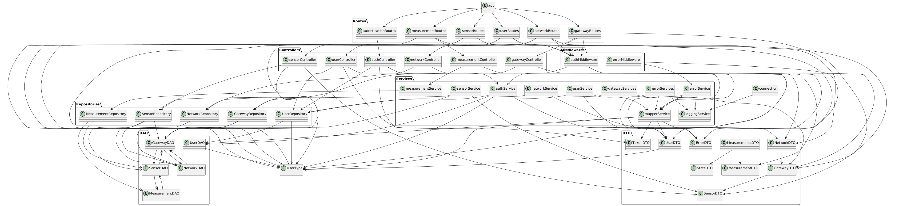
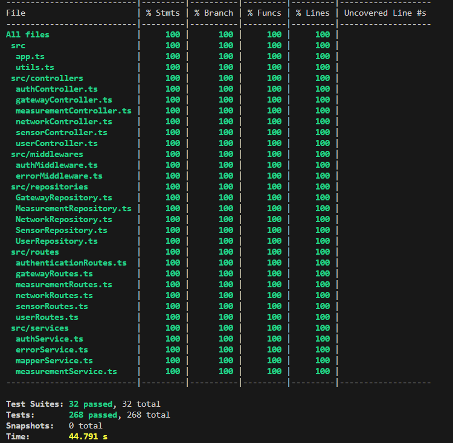

# Test Report

Project Tite: Geocontrol  
Test Report Version: 1.0  
Prepared by: Team 29

# Introduction

This test report summarizes the testing activities and its result. The goal of the testing was to verify the functionality of the back-end part of the system and its integration with the front-end.

# Contents

- [Test Report](#test-report)
- [Introduction](#introduction)
- [Contents](#contents)
- [Test Scope](#test-scope)
- [Test Environment](#test-environment)
- [Dependency graph](#dependency-graph)
- [Integration approach](#integration-approach)
- [Tests](#tests)
    - [End-to-End Testing](#end-to-end-testing)
    - [authController.integration.test](#authcontrollerintegrationtest)
    - [gatewayController.integration.test](#gatewaycontrollerintegrationtest)
    - [measurementController.integration.test](#measurementcontrollerintegrationtest)
    - [networkController.integration.test](#networkcontrollerintegrationtest)
    - [sensorController.integration.test](#sensorcontrollerintegrationtest)
    - [userController.integration.test](#usercontrollerintegrationtest)
    - [authenticationRoutes.integration.test](#authenticationroutesintegrationtest)
    - [gatewayRoutes.integration.test](#gatewayroutesintegrationtest)
    - [measurementRoutes.integration.test](#measurementroutesintegrationtest)
    - [networkRoutes.integration.test](#networkroutesintegrationtest)
    - [sensorRoutes.integration.test](#sensorroutesintegrationtest)
    - [userRoutes.integration.test](#userroutesintegrationtest)
    - [GatewayRepository.test](#gatewayrepositorytest)
    - [MeasurementRepository.test](#measurementrepositorytest)
    - [NetworkRepository.test](#networkrepositorytest)
    - [SensorRepository.test](#sensorrepositorytest)
    - [UserRepository.test](#userrepositorytest)
    - [AuthService.test](#authservicetest)
    - [ErrorService.test](#errorservicetest)
    - [mapperService.test](#mapperservicetest)
    - [measurementService.test](#measurementservicetest)
- [Coverage](#coverage)
  - [Coverage of FR](#coverage-of-fr)
  - [Coverage white box](#coverage-white-box)
- [Conclusion](#conclusion)

# Test Scope

- User authentication and management (FR1 & FR2)
- Management of networks (FR3)
- Management of gateways (FR4)
- Management of sensors (FR5)
- Management of measurement, statistics e outlier (FR6)

Out of scope:
- GUI testing
- External integration with third-party services

# Test Environment

| Component    | Version                   |
| ------------ | ------------------------- |
| Backend      | Node.js v22.15.1          |
| Database     | SQLite v3.49.1            |

# Dependency graph

    @startuml

      package "Routes"{
        class autenticationRoutes
        class gatewayRoutes
        class measurementRoutes
        class networkRoutes
        class sensorRoutes
        class userRoutes
      }

      package "Controllers"{
        class authController
        class gatewayController
        class measurementController
        class networkController
        class sensorController
        class userController
      }

      package "Repositories"{
        class GatewayRepository
        class MeasurementRepository
        class NetworkRepository
        class SensorRepository
        class UserRepository
      }

      package "Services"{
        class authService
        class errorServices
        class gatewayServices
        class mapperService
        class measurementService
        class networkService
        class sensorService
        class userService
        class errorService
        class loggingService
      }

      package "DAO"{
        class GatewayDAO
        class MeasurementDAO
        class NetworkDAO
        class SensorDAO
        class UserDAO
      }

      package "DTO"{
        class GatewayDTO
        class MeasurementsDTO
        class MeasurementsDTO
        class NetworkDTO
        class UserDTO
        class SensorDTO
        class StatsDTO
        class MeasurementsDTO
        class MeasurementDTO
        class TokenDTO
        class ErrorDTO
      }

      package "Middlewares"{
        class authMiddleware
        class errorMiddleware
      }
      
      
      app -down-> autenticationRoutes
      app -down-> userRoutes
      app -down-> gatewayRoutes
      app -down-> sensorRoutes
      app -down-> measurementRoutes
      app -down-> networkRoutes

      'Routes
        autenticationRoutes -down-> authController

        gatewayRoutes -down-> gatewayController
        gatewayRoutes -down-> GatewayDTO
        gatewayRoutes -down-> UserType
        gatewayRoutes -down-> authMiddleware

        measurementRoutes -down-> measurementController
        measurementRoutes -down-> UserType
        measurementRoutes -down-> authMiddleware

        networkRoutes -down-> networkController
        networkRoutes -down-> NetworkDTO
        networkRoutes -down-> UserType
        networkRoutes -down-> authMiddleware

        sensorRoutes -down-> sensorController
        sensorRoutes -down-> SensorDTO
        sensorRoutes -down-> UserType
        sensorRoutes -down-> authMiddleware

        userRoutes -down-> userController
        userRoutes -down-> UserDTO
        userRoutes -down-> UserType
        userRoutes -down-> authMiddleware

      'Controllers
        authController -down-> UserDTO
        authController -down-> TokenDTO
        authController -down-> UserRepository
        authController -down-> authService
        authController -down-> mapperService

        gatewayController -down-> GatewayDTO
        gatewayController -down-> GatewayRepository

        measurementController -down-> MeasurementDTO
        measurementController -down-> measurementService

        networkController -down-> NetworkDTO
        networkController -down-> NetworkRepository

        sensorController -down-> SensorDTO
        sensorController -down-> SensorRepository
        sensorController -down-> GatewayDAO

        userController -down-> UserDTO
        userController -down-> UserRepository
        userController -down-> mapperService
      

      'Repositories
        GatewayRepository -down-> NetworkDAO
        GatewayRepository -down-> GatewayDAO

        MeasurementRepository -down-> MeasurementDAO
        MeasurementRepository -down-> SensorDAO

        NetworkRepository -down-> NetworkDAO

        SensorRepository -down-> NetworkDAO
        SensorRepository -down-> SensorDAO
        SensorRepository -down-> GatewayDAO

        UserRepository -down-> UserDAO
        UserRepository -down-> UserType
      

      'Services
        authService -down-> UserDTO
        authService -down-> UserType
        authService -down-> UserRepository
        authService -down-> UserDAO

        errorServices -down-> ErrorDTO
        errorServices -down-> loggingService
        errorServices -down-> mapperService

        gatewayServices -down-> GatewayRepository
        gatewayServices -down-> GatewayDTO

        mapperService -down-> TokenDTO
        mapperService -down-> UserDTO
        mapperService -down-> UserDAO
        mapperService -down-> ErrorDTO
        mapperService -down-> UserType

        measurementService -down-> MeasurementRepository

        networkService -down-> NetworkRepository
        networkService -down-> NetworkDTO

        sensorService -down-> SensorRepository
        sensorService -down-> SensorDTO
        sensorService -down-> GatewayDAO

        userService -down-> UserRepository
        userService -down-> UserDTO
        userService -down-> mapperService

        errorService -down-> ErrorDTO
        errorService -down-> loggingService
        errorService -down-> mapperService
      

      'DAO
        GatewayDAO -down-> NetworkDAO
        GatewayDAO -down-> SensorDAO

        MeasurementDAO -down-> SensorDAO

        NetworkDAO -down-> GatewayDAO

        SensorDAO -down-> GatewayDAO
        SensorDAO -down-> MeasurementDAO

        UserDAO -down-> UserType
      

      'DTO
        GatewayDTO -down-> SensorDTO

        MeasurementsDTO -down-> MeasurementDTO
        MeasurementsDTO -down-> StatsDTO

        NetworkDTO -down-> GatewayDTO

        UserDTO -down-> UserType
    

      'Middlewares
        authMiddleware -down-> UserDTO
        authMiddleware -down-> UserType
        authMiddleware -down-> authService

        errorMiddleware -down-> errorService
        errorMiddleware -down-> ErrorDTO
      

      'database

        connection -down-> loggingService

    @enduml

  

# Integration approach

The integration approach adopted for the GeoControl system follows a hybrid (bottom-up and top-down) strategy. The process is structured as follows:

1. **Unit Testing (Bottom-Up):**
   - Each repository and service is tested in isolation using unit tests. This ensures that the core business logic and data access layers behave as expected, including edge cases and error handling.
   - Mocking is used to isolate dependencies and focus on the logic of the unit under test.

2. **Integration Testing (Bottom-Up):**
   - Controllers are tested together with their real dependencies (repositories/services) to verify the correct orchestration of components and the handling of real data flows.
   - Integration tests also cover error propagation and the mapping of exceptions to API responses.

3. **Route/API Testing (Top-Down):**
   - Route-level integration tests validate the full request/response cycle, including authentication, authorization, and middleware logic.
   - These tests ensure that the API endpoints conform to the documented Swagger/OpenAPI specifications, including response structure (e.g., presence and correctness of fields like `isOutlier`, `startDate`, `endDate`) and error DTOs.
   - Contract validation is performed to guarantee that the API responses match the expected schemas.

4. **End-to-End (E2E) Testing:**
   - E2E tests simulate real user scenarios, covering the entire stack from HTTP request to database and back.
   - These tests verify the correct integration of all system components and the fulfillment of functional requirements (FRs).

# Tests

<in the table below list the test cases defined For each test report the object tested, the test level (API, integration, unit) and the technique used to define the test case (BB/ eq partitioning, BB/ boundary, WB/ statement coverage, etc)> <split the table if needed>

### End-to-End Testing
| Test case name                                            | Object(s) tested | Test level | Technique used |
| :-------------------------------------------------------: | :--------------: | :--------: | :------------: |
| get all user (e2e)                                        |                  | system     |       BB       |
| create user (e2e)                                         |                  | system     |       BB       |
| get user by username (e2e)                                |                  | system     |       BB       |
| delete user (e2e)                                         |                  | system     |       BB       |
| should create, get, update, and delete a network (e2e)    |                  | system     |       BB       |
| should create, get, update, and delete a gateway (e2e)    |                  | system     |       BB       |
| should create, get, update, and delete a sensor (e2e)     |                  | system     |       BB       |
| should record and get measurements, stats, outliers (e2e) |                  | system     |       BB       |

### authController.integration.test
| Test case name                                            | Object(s) tested | Test level | Technique used |
| :-------------------------------------------------------: | :--------------: | :--------: | :------------: |
| getToken - success                                        | authController.getToken	                | integration |     BB-eqp     |
| getToken - invalid password                               | authController.getToken	                | integration |     BB-eqp     |

### gatewayController.integration.test
| Test case name                                            | Object(s) tested | Test level | Technique used |
| :-------------------------------------------------------: | :--------------: | :--------: | :------------: |
| getGatewaysByNetwork                                      | gatewayController.getGatewaysByNetwork  | integration |     BB-eqp     |
| getGatewayByMac                                           | gatewayController.getGatewayByMac	      | integration |     BB-eqp     |
| createGateway                                             | gatewayController.createGateway	        | integration |     BB-eqp     |
| updateGateway                                             | gatewayController.updateGateway	        | integration |     BB-eqp     |
| deleteGateway                                             | gatewayController.deleteGateway	        | integration |     BB-eqp     |

### measurementController.integration.test
| Test case name                                            | Object(s) tested | Test level | Technique used |
| :-------------------------------------------------------: | :--------------: | :--------: | :------------: |
| recordMeasurement                                         | measurementController.recordMeasurement        | unit        |     BB-eqp     |
| getMeasurementsBySensor                                   | measurementController.getMeasurementsBySensor  | integration |     BB-eqp     |
| getStatisticsBySensor                                     | measurementController.getStatisticsBySensor    | integration |     BB-eqp     |
| getOutliersBySensor                                       | measurementController.getOutliersBySensor      | integration |     BB-eqp     |
| getMeasurementsByNetwork                                  | measurementController.getMeasurementsByNetwork | integration |     BB-eqp     |
| getStatisticsByNetwork                                    | measurementController.getStatisticsByNetwork   | integration |     BB-eqp     |
| getOutliersByNetwork                                      | measurementController.getOutliersByNetwork     | integration |     BB-eqp     |
| getMeasurementsBySensor with dates                        | measurementController.getMeasurementsBySensor  | integration |     BB-eqp     |
| getStatisticsBySensor with dates                          | measurementController.getStatisticsBySensor    | integration |     BB-eqp     |
| getOutliersBySensor with dates                            | measurementController.getOutliersBySensor      | integration |     BB-eqp     |
| getMeasurementsByNetwork with dates                       | measurementController.getMeasurementsByNetwork | integration |     BB-eqp     |
| getStatisticsByNetwork with dates                         | measurementController.getStatisticsByNetwork   | integration |     BB-eqp     |
| getOutliersByNetwork with dates                           | measurementController.getOutliersByNetwork     | integration |     BB-eqp     |
| getMeasurementsBySensor returns isOutlier undefined if thresholds missing | measurementController.getMeasurementsBySensor | integration | BB-eqp |
| getMeasurementsBySensor returns isOutlier true if value is outlier | measurementController.getMeasurementsBySensor | integration | BB-eqp |
| getMeasurementsBySensor returns isOutlier false if value is not outlier | measurementController.getMeasurementsBySensor | integration | BB-eqp |
| getMeasurementsByNetwork returns isOutlier undefined if thresholds missing | measurementController.getMeasurementsByNetwork | integration | BB-eqp |
| getMeasurementsByNetwork returns isOutlier true if value is outlier | measurementController.getMeasurementsByNetwork | integration | BB-eqp |
| getMeasurementsByNetwork returns isOutlier false if value is not outlier | measurementController.getMeasurementsByNetwork | integration | BB-eqp |
| getStatisticsBySensor includes startDate and endDate fields | measurementController.getStatisticsBySensor | integration | BB-eqp |
| getStatisticsByNetwork includes startDate and endDate fields | measurementController.getStatisticsByNetwork | integration | BB-eqp |

### networkController.integration.test
| Test case name                                            | Object(s) tested | Test level | Technique used |
| :-------------------------------------------------------: | :--------------: | :--------: | :------------: |
| getAllNetworks                                            | networkController.getAllNetworks               | integration |     BB-eqp     |
| getNetworkByCode                                          | networkController.getNetworkByCode             | integration |     BB-eqp     |
| createNetwork                                             | networkController.createNetwork                | integration |     BB-eqp     |
| updateNetwork                                             | networkController.updateNetwork                | integration |     BB-eqp     |
| deleteNetwork                                             | networkController.deleteNetwork                | integration |     BB-eqp     |

### sensorController.integration.test
| Test case name                                            | Object(s) tested | Test level | Technique used |
| :-------------------------------------------------------: | :--------------: | :--------: | :------------: |
| getSensorsByGateway                                       | sensorController.getSensorsByGateway           | integration |     BB-eqp     |
| getSensorByMac                                            | sensorController.getSensorByMac                | integration |     BB-eqp     |
| createSensor                                              | sensorController.createSensor                  | integration |     BB-eqp     |
| updateSensor                                              | sensorController.updateSensor                  | integration |     BB-eqp     |
| deleteSensor                                              | sensorController.deleteSensor                  | integration |     BB-eqp     |
| createSensor - gateway not found                          | sensorController.createSensor                  | integration |     BB-eqp     |

### userController.integration.test
| Test case name                                            | Object(s) tested | Test level | Technique used |
| :-------------------------------------------------------: | :--------------: | :--------: | :------------: |
| get User: mapperService integration                       | userController.getUser                         | integration |     BB-eqp     |

### authenticationRoutes.integration.test
| Test case name                                            | Object(s) tested | Test level | Technique used |
| :-------------------------------------------------------: | :--------------: | :--------: | :------------: |
| should return 200 and a token for valid credentials       | authController.getToken                        | integration |     BB-eqp     |
| should return 400 if request body is invalid              | authController.getToken                        | integration |     BB-eqp     |
| should return 401 for invalid credentials                 | authController.getToken                        | integration |     BB-eqp     |
| should return 404 for user not found                      | authController.getToken                        | integration |     BB-eqp     |
| should return 500 on unexpected error                     | authController.getToken                        | integration |     BB-eqp     |

### gatewayRoutes.integration.test
| Test case name                                            | Object(s) tested | Test level | Technique used |
| :-------------------------------------------------------: | :--------------: | :--------: | :------------: |
| get all gateways by network                               | authService.processToken, gatewayController.getGatewaysByNetwork     | integration | BB-eqp |
| get gateway by mac                                       | authService.processToken, gatewayController.getGatewayByMac          | integration | BB-eqp |
| create gateway                                           | authService.processToken, gatewayController.createGateway            | integration | BB-eqp |
| update gateway                                           | authService.processToken, gatewayController.updateGateway            | integration | BB-eqp |
| delete gateway                                           | authService.processToken, gatewayController.deleteGateway            | integration | BB-eqp |
| get all gateways: 404 Network Not Found                  | authService.processToken, gatewayController.getGatewaysByNetwork     | integration | BB-eqp |
| create gateway: 404 Network Not Found                    | authService.processToken, gatewayController.createGateway            | integration | BB-eqp |
| get all gateways: 401 UnauthorizedError                  | authService.processToken                                           | integration | BB-eqp |
| get all gateways: 403 InsufficientRightsError            | authService.processToken                                           | integration | BB-eqp |
| get all gateways: error handler                          | authService.processToken, gatewayController.getGatewaysByNetwork     | integration | BB-eqp |
| create gateway: error handler                            | authService.processToken, gatewayController.createGateway            | integration | BB-eqp |
| get gateway by mac: error handler                        | authService.processToken, gatewayController.getGatewayByMac          | integration | BB-eqp |
| update gateway: error handler                            | authService.processToken, gatewayController.updateGateway            | integration | BB-eqp |
| delete gateway: error handler                            | authService.processToken, gatewayController.deleteGateway            | integration | BB-eqp |
| create gateway: 400 BadRequest                           | authService.processToken, gatewayController.createGateway            | integration | BB-eqp |
| create gateway: 409 Conflict                             | authService.processToken, gatewayController.createGateway            | integration | BB-eqp |

### measurementRoutes.integration.test
| Test case name                                            | Object(s) tested | Test level | Technique used |
| :-------------------------------------------------------: | :--------------: | :--------: | :------------: |
| record measurement                                       | authService.processToken, measurementController.recordMeasurement | integration | BB-eqp |
| get measurements by sensor                               | authService.processToken, measurementController.getMeasurementsBySensor | integration | BB-eqp |
| get statistics by sensor                                 | authService.processToken, measurementController.getStatisticsBySensor | integration | BB-eqp |
| get outliers by sensor                                   | authService.processToken, measurementController.getOutliersBySensor | integration | BB-eqp |
| get measurements by network                              | authService.processToken, measurementController.getMeasurementsByNetwork | integration | BB-eqp |
| get statistics by network                                | authService.processToken, measurementController.getStatisticsByNetwork | integration | BB-eqp |
| get outliers by network                                  | authService.processToken, measurementController.getOutliersByNetwork | integration | BB-eqp |
| record measurement: 401 UnauthorizedError                | authService.processToken                                           | integration | BB-eqp |
| record measurement: 403 InsufficientRightsError          | authService.processToken                                           | integration | BB-eqp |
| record measurement: error handler                        | authService.processToken, measurementController.recordMeasurement | integration | BB-eqp |
| get measurements by sensor: error handler                | authService.processToken, measurementController.getMeasurementsBySensor | integration | BB-eqp |
| get statistics by sensor: error handler                  | authService.processToken, measurementController.getStatisticsBySensor | integration | BB-eqp |
| get outliers by sensor: error handler                    | authService.processToken, measurementController.getOutliersBySensor | integration | BB-eqp |
| get measurements by network: error handler               | authService.processToken, measurementController.getMeasurementsByNetwork | integration | BB-eqp |
| get statistics by network: error handler                 | authService.processToken, measurementController.getStatisticsByNetwork | integration | BB-eqp |
| get outliers by network: error handler                   | authService.processToken, measurementController.getOutliersByNetwork | integration | BB-eqp |
| record measurement: 400 BadRequest                       | authService.processToken, measurementController.recordMeasurement | integration | BB-eqp |
| record measurement: 404 NotFound                         | authService.processToken, measurementController.recordMeasurement | integration | BB-eqp |
| record measurement: 409 Conflict                         | authService.processToken, measurementController.recordMeasurement | integration | BB-eqp |
| get measurements by sensor: 400 BadRequest               | authService.processToken, measurementController.getMeasurementsBySensor | integration | BB-eqp |
| get measurements by sensor: 404 NotFound                 | authService.processToken, measurementController.getMeasurementsBySensor | integration | BB-eqp |
| get measurements by sensor: 409 Conflict                 | authService.processToken, measurementController.getMeasurementsBySensor | integration | BB-eqp |
| get statistics by sensor: 404 NotFound                   | authService.processToken, measurementController.getStatisticsBySensor | integration | BB-eqp |
| get outliers by sensor: 404 NotFound                     | authService.processToken, measurementController.getOutliersBySensor | integration | BB-eqp |
| get measurements by network: 404 NotFound                | authService.processToken, measurementController.getMeasurementsByNetwork | integration | BB-eqp |
| get statistics by network: 404 NotFound                  | authService.processToken, measurementController.getStatisticsByNetwork | integration | BB-eqp |
| get outliers by network: 404 NotFound                    | authService.processToken, measurementController.getOutliersByNetwork | integration | BB-eqp |

### networkRoutes.integration.test
| Test case name                                            | Object(s) tested | Test level | Technique used |
| :-------------------------------------------------------: | :--------------: | :--------: | :------------: |
| get all networks | authService.processToken, networkController.getAllNetworks | integration | BB-eqp |
| get network by code | authService.processToken, networkController.getNetworkByCode | integration | BB-eqp |
| create network | authService.processToken, networkController.createNetwork | integration | BB-eqp |
| update network | authService.processToken, networkController.updateNetwork | integration | BB-eqp |
| delete network | authService.processToken, networkController.deleteNetwork | integration | BB-eqp |
| get all networks: 401 UnauthorizedError | authService.processToken | integration | BB-eqp |
| get all networks: 403 InsufficientRightsError | authService.processToken | integration | BB-eqp |
| get all networks: error handler | authService.processToken, networkController.getAllNetworks | integration | BB-eqp |
| create network: error handler | authService.processToken, networkController.createNetwork | integration | BB-eqp |
| get network by code: error handler | authService.processToken, networkController.getNetworkByCode | integration | BB-eqp |
| update network: error handler | authService.processToken, networkController.updateNetwork | integration | BB-eqp |
| delete network: error handler | authService.processToken, networkController.deleteNetwork | integration | BB-eqp |
| get network by code: 400 BadRequest | authService.processToken, networkController.getNetworkByCode | integration | BB-eqp |
| get network by code: 401 Unauthorized | authService.processToken | integration | BB-eqp |
| get network by code: 403 Forbidden | authService.processToken | integration | BB-eqp |
| get network by code: 404 NotFound | authService.processToken, networkController.getNetworkByCode | integration | BB-eqp |
| get network by code: 409 Conflict | authService.processToken, networkController.getNetworkByCode | integration | BB-eqp |
| get network by code: 500 InternalServerError | authService.processToken, networkController.getNetworkByCode | integration | BB-eqp |

### sensorRoutes.integration.test
| Test case name                                            | Object(s) tested | Test level | Technique used |
| :-------------------------------------------------------: | :--------------: | :--------: | :------------: |
| get all sensors by gateway | authService.processToken, sensorController.getSensorsByGateway | integration | BB-eqp |
| get sensor by mac | authService.processToken, sensorController.getSensorByMac | integration | BB-eqp |
| create sensor | authService.processToken, sensorController.createSensor | integration | BB-eqp |
| update sensor | authService.processToken, sensorController.updateSensor | integration | BB-eqp |
| delete sensor | authService.processToken, sensorController.deleteSensor | integration | BB-eqp |
| get all sensors: 401 UnauthorizedError | authService.processToken | integration | BB-eqp |
| get all sensors: 403 InsufficientRightsError | authService.processToken | integration | BB-eqp |
| get all sensors: error handler | authService.processToken, sensorController.getSensorsByGateway | integration | BB-eqp |
| create sensor: error handler | authService.processToken, sensorController.createSensor | integration | BB-eqp |
| get sensor by mac: error handler | authService.processToken, sensorController.getSensorByMac | integration | BB-eqp |
| update sensor: error handler | authService.processToken, sensorController.updateSensor | integration | BB-eqp |
| delete sensor: error handler | authService.processToken, sensorController.deleteSensor | integration | BB-eqp |
| get all sensors: 400 BadRequest | authService.processToken, sensorController.getSensorsByGateway | integration | BB-eqp |
| get all sensors: 404 NotFound | authService.processToken, sensorController.getSensorsByGateway | integration | BB-eqp |
| get all sensors: 409 Conflict | authService.processToken, sensorController.getSensorsByGateway | integration | BB-eqp |
| create sensor: 400 BadRequest | authService.processToken, sensorController.createSensor | integration | BB-eqp |
| create sensor: 404 NotFound | authService.processToken, sensorController.createSensor | integration | BB-eqp |
| create sensor: 409 Conflict | authService.processToken, sensorController.createSensor | integration | BB-eqp |
| get sensor by mac: 404 NotFound | authService.processToken, sensorController.getSensorByMac | integration | BB-eqp |
| update sensor: 404 NotFound | authService.processToken, sensorController.updateSensor | integration | BB-eqp |
| delete sensor: 404 NotFound | authService.processToken, sensorController.deleteSensor | integration | BB-eqp |

### userRoutes.integration.test
| Test case name                                            | Object(s) tested | Test level | Technique used |
| :-------------------------------------------------------: | :--------------: | :--------: | :------------: |
| get all users | authService.processToken, userController.getAllUsers | integration | BB-eqp |
| get all users: 401 UnauthorizedError | authService.processToken | integration | BB-eqp |
| get all users: 403 InsufficientRightsError | authService.processToken | integration | BB-eqp |
| get all users: 500 error handler | authService.processToken, userController.getAllUsers | integration | BB-eqp |
| create user: 201 Created | authService.processToken, userController.createUser | integration | BB-eqp |
| create user: 400 BadRequest | authService.processToken | integration | BB-eqp |
| create user: 401 UnauthorizedError | authService.processToken | integration | BB-eqp |
| create user: 403 InsufficientRightsError | authService.processToken | integration | BB-eqp |
| create user: 409 Conflict | authService.processToken, userController.createUser | integration | BB-eqp |
| create user: 500 error handler | authService.processToken, userController.createUser | integration | BB-eqp |
| delete user: 204 No Content | authService.processToken, userController.deleteUser | integration | BB-eqp |
| delete user: 401 UnauthorizedError | authService.processToken | integration | BB-eqp |
| delete user: 403 InsufficientRightsError | authService.processToken | integration | BB-eqp |
| delete user: 404 NotFound | authService.processToken, userController.deleteUser | integration | BB-eqp |
| delete user: 500 error handler | authService.processToken, userController.deleteUser | integration | BB-eqp |

### GatewayRepository.test
| Test case name                                            | Object(s) tested | Test level | Technique used |
| :-------------------------------------------------------: | :--------------: | :--------: | :------------: |
| create gateway | GatewayRepository.createGateway | unit | BB-eqp |
| find gateway by macAddress: not found | GatewayRepository.getGatewayByMacAddress | unit | BB-eqp |
| create gateway: conflict | GatewayRepository.createGateway | unit | BB-eqp |
| update gateway | GatewayRepository.updateGateway | unit | BB-eqp |
| create gateway: network not found | GatewayRepository.createGateway | unit | BB-eqp |
| update gateway: network not found | GatewayRepository.updateGateway | unit | BB-eqp |

### MeasurementRepository.test
| Test case name                                            | Object(s) tested | Test level | Technique used |
| :-------------------------------------------------------: | :--------------: | :--------: | :------------: |
| create, get, statistics, outliers | MeasurementRepository.createMeasurement, MeasurementRepository.getMeasurements, MeasurementRepository.getStatistics, MeasurementRepository.getOutliers | unit | BB-eqp |
| createMeasurement - sensor not found | MeasurementRepository.createMeasurement | unit | BB-eqp |
| getStatistics - no data | MeasurementRepository.getStatistics | unit | BB-eqp |
| getMeasurementsByNetwork, getStatisticsByNetwork, getOutliersByNetwork | MeasurementRepository.getMeasurementsByNetwork, MeasurementRepository.getStatisticsByNetwork, MeasurementRepository.getOutliersByNetwork | unit | BB-eqp |
| getMeasurements - with date filters | MeasurementRepository.getMeasurements | unit | BB-eqp |
| getOutliers - no outliers | MeasurementRepository.getOutliers | unit | BB-eqp |
| getOutliers - with outlier | MeasurementRepository.getOutliers | unit | BB-eqp |
| getMeasurementsByNetwork - with date filters | MeasurementRepository.getMeasurementsByNetwork | unit | BB-eqp |
| getStatisticsByNetwork - no data | MeasurementRepository.getStatisticsByNetwork | unit | BB-eqp |
| getOutliersByNetwork - no data | MeasurementRepository.getOutliersByNetwork | unit | BB-eqp |
| getStatistics - throws if no measurements | MeasurementRepository.getStatistics | unit | BB-eqp |
| getOutliers - throws if no measurements | MeasurementRepository.getOutliers | unit | BB-eqp |
| getStatistics includes startDate and endDate fields | MeasurementRepository.getStatistics | unit | BB-eqp |
| getStatisticsByNetwork includes startDate and endDate fields | MeasurementRepository.getStatisticsByNetwork | unit | BB-eqp |

### NetworkRepository.test
| Test case name                                            | Object(s) tested | Test level | Technique used |
| :-------------------------------------------------------: | :--------------: | :--------: | :------------: |
| create network | NetworkRepository.createNetwork | unit | BB-eqp |
| find network by code: not found | NetworkRepository.getNetworkByNetworkCode | unit | BB-eqp |
| create network: conflict | NetworkRepository.createNetwork | unit | BB-eqp |
| update network | NetworkRepository.updateNetwork | unit | BB-eqp |
| update network: not found | NetworkRepository.updateNetwork | unit | BB-eqp |
| getAllNetworks | NetworkRepository.getAllNetworks | unit | BB-eqp |
| delete network: not found | NetworkRepository.deleteNetwork | unit | BB-eqp |

### SensorRepository.test
| Test case name                                            | Object(s) tested | Test level | Technique used |
| :-------------------------------------------------------: | :--------------: | :--------: | :------------: |
| create, get, update, delete sensor | SensorRepository.createSensor, SensorRepository.getSensorByMacAddress, SensorRepository.updateSensor, SensorRepository.deleteSensor | unit | BB-eqp |
| createSensor - conflict | SensorRepository.createSensor | unit | BB-eqp |
| getSensorByMacAddress - not found | SensorRepository.getSensorByMacAddress | unit | BB-eqp |
| updateSensor - not found | SensorRepository.updateSensor | unit | BB-eqp |
| deleteSensor - not found | SensorRepository.deleteSensor | unit | BB-eqp |

### UserRepository.test
| Test case name                                            | Object(s) tested | Test level | Technique used |
| :-------------------------------------------------------: | :--------------: | :--------: | :------------: |
| create user | UserRepository.createUser | unit | BB-eqp |
| find user by username: not found | UserRepository.getUserByUsername | unit | BB-eqp |
| create user: conflict | UserRepository.createUser | unit | BB-eqp |
| getAllUsers | UserRepository.getAllUsers | unit | BB-eqp |
| delete User: not found | UserRepository.deleteUser | unit | BB-eqp |

### AuthService.test
| Test case name                                            | Object(s) tested | Test level | Technique used |
| :-------------------------------------------------------: | :--------------: | :--------: | :------------: |
| should generate a JWT token | authService.generateToken | unit | BB-eqp |
| work without role restriction | authService.processToken | unit | BB-eqp |
| work if user has allowed role | authService.processToken | unit | BB-eqp |
| throw if user has unauthorized role | authService.processToken | unit | BB-eqp |
| throw if user is not found | authService.processToken | unit | BB-eqp |
| throw if token is missing | authService.processToken | unit | BB-eqp |
| throw if token is malformed | authService.processToken | unit | BB-eqp |
| throw UnauthorizedError if jwt.verify fails with generic error | authService.processToken | unit | BB-eqp |
| rethrow existing AppError (UnauthorizedError) | authService.processToken | unit | BB-eqp |
| should allow access when allowedRoles is empty | authService.processToken | unit | BB-eqp |
| should allow access when user type is in allowedRoles | authService.processToken | unit | BB-eqp |
| should reject access when user type is not in allowedRoles | authService.processToken | unit | BB-eqp |
| should allow access when allowedRoles is omitted | authService.processToken | unit | BB-eqp |

### ErrorService.test
| Test case name                                            | Object(s) tested | Test level | Technique used |
| :-------------------------------------------------------: | :--------------: | :--------: | :------------: |
| should handle a generic error | errorService.createAppError | unit | BB-eqp |
| should handle an error without message | errorService.createAppError | unit | BB-eqp |
| should handle an AppError | errorService.createAppError | unit | BB-eqp |
| should handle an error with status (non-AppError) | errorService.createAppError | unit | BB-eqp |

### mapperService.test
| Test case name                                            | Object(s) tested | Test level | Technique used |
| :-------------------------------------------------------: | :--------------: | :--------: | :------------: |
| should return a token dto with token | mapperService.createTokenDTO | unit | BB-eqp |
| should remove undefined token | mapperService.createTokenDTO | unit | BB-eqp |
| should return full user dto with all fields | mapperService.createUserDTO | unit | BB-eqp |
| should remove password if undefined | mapperService.createUserDTO | unit | BB-eqp |
| should remove password if null | mapperService.createUserDTO | unit | BB-eqp |
| should map UserDAO to DTO | mapperService.mapUserDAOToDTO | unit | BB-eqp |
| should include all non-null fields | mapperService.createErrorDTO | unit | BB-eqp |
| should exclude null fields | mapperService.createErrorDTO | unit | BB-eqp |
| should exclude undefined fields | mapperService.createErrorDTO | unit | BB-eqp |
| should exclude fields with empty arrays | mapperService.removeNullAttributes | unit | BB-eqp |

### measurementService.test
| Test case name                                            | Object(s) tested | Test level | Technique used |
| :-------------------------------------------------------: | :--------------: | :--------: | :------------: |
| calls getStatistics on the repository | measurementService.getStatistics | unit | BB-eqp |
| calls getOutliers on the repository | measurementService.getOutliers | unit | BB-eqp |

# Coverage

## Coverage of FR

| Functional Requirement or scenario | Test(s)                                                        |
| :--------------------------------: | :------------------------------------------------------------: |
|                FR2.1               |    get all user (e2e)                                          |
|                FR2.2               |    create user (e2e)                                           |
|                FR2.3               |    get user by username (e2e)                                  |
|                FR2.4               |    delete user (e2e)                                           |
|                FR3                 |    should create, get, update, and delete a network (e2e)      |
|                FR4                 |    should create, get, update, and delete a gateway (e2e)      |
|                FR5                 |    should create, get, update, and delete a sensor (e2e)       |
|                FR6                 |    should record and get measurements, stats, outliers (e2e)   |

## Coverage white box

# Conclusion

The first testing phase has been succesfull and all issue that arose during its conduction have been resolved.